# Spark Project

In this module we will explore the key concepts of spark. We are going to focus on following topics. 

- An Introduction and Overview
- Spark Architecture
- Spark Core
- Spark SQL
- Spark Streaming
- Spark Graphs
- Spark MLib

## An Introduction and Overview

Definition:
Apache spark is a distributed data processing framework for big data workloads. It offers development API in Scala, 
Python, R and Java.

The following diagram helps us to understand, how the spark ecosystem is stitched up.    

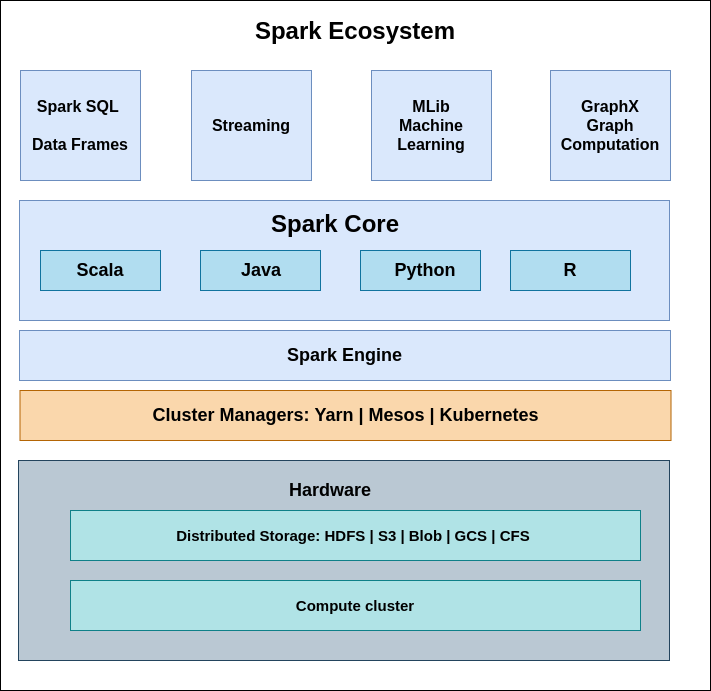 

Spark Core: Spark Core is the underlying general execution engine for the Spark platform that all other functionality is
built on top of. It provides in-memory computing capabilities to deliver speed, a generalized execution model to support
 a wide variety of applications, and Java, Scala, and Python APIs for ease of development. 

Spark SQL & Dataframes: Spark SQL is a Spark module for structured data processing. It provides a programming 
abstraction called DataFrames and can also act as distributed SQL query engine. It enables unmodified Hadoop Hive 
queries to run up to 100x faster on existing deployments and data. It also provides powerful integration with the rest 
of the Spark ecosystem (e.g., integrating SQL query processing with machine learning).

Spark Streaming: Spark Streaming is an extension of the core Spark API that enables scalable, high-throughput, 
fault-tolerant stream processing of live data streams.

Mlib(Machine Learning library): MLlib is a scalable machine learning library that delivers both high-quality algorithms 
(e.g., multiple iterations to increase accuracy) and blazing speed (up to 100x faster than MapReduce). The library is 
usable in Java, Scala, and Python as part of Spark applications, so that you can include it in complete workflows.

GraphX: GraphX is a graph computation engine built on top of Spark that enables users to interactively build, transform 
and reason about graph structured data at scale. It comes complete with a library of common algorithms.

Cluster managers: Since spark does not manage the cluster, we need a cluster manager/ resource manager/ Container 
orchestrator. Initially spark was based on Hadoop Map reduce, it adopted hadoop platform. The hadoop yarn resource 
manager is one of the most widely used cluster manager for spark. Mesos and
Kubernetes are other alternative cluster managers. 

Distributed Storage: Spark also does not have a built in storage system. It allows us to process data which is store 
in variety of storage systems. Few of common storage systems are HDFS(Hadoop distributed file System), AWS S3, 
Azure Blob, GCP (Google cloud storage), CFS (Cassandra file system).

Spark compute engine runs and manages data processing work and provides user a seamless experience.   
 
## Spark Architecture  

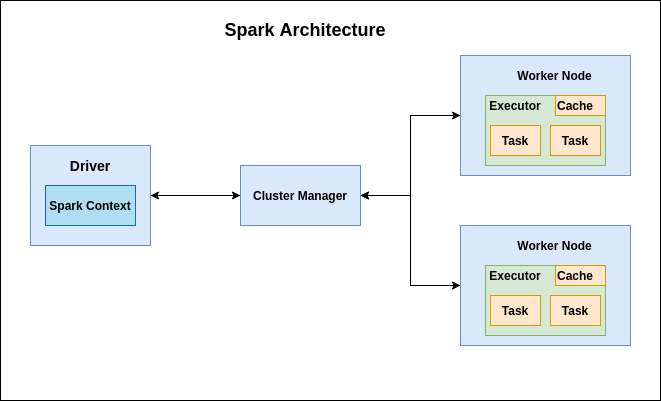 

The Spark has a hierarchical master salve architecture. The spark driver acts as a master controlling the cluster 
manager, which managers the worker nodes and provides results to the application.

The Spark architecture depends upon two abstractions:
- Resilient Distributed Dataset(RDD)
- Directed Acyclic graph.

##### Resilient Distributed Dataset (RDD) 
RDD are fault-tolerant collections of elements that can be distributed among multiple nodes in a cluster and worked on 
in parallel. RDDs are a fundamental structure in Apache Spark.

Spark loads data by referencing a data source or by paralleizing an existing collection with the SparkContext
 parallelize method into an RDD for processing. Once data is loaded into an RDD, Spark performs transformations and 
 actions on RDDs in memory—the key to Spark’s speed. Spark also stores the data in memory unless the system runs out of 
 memory or the user decides to write the data to disk for persistence.

Each dataset in an RDD is divided into logical partitions, which may be computed on different nodes of the cluster. And,
 users can perform two types of RDD operations: transformations and actions. Transformations are operations applied to 
 create a new RDD. Actions are used to instruct Apache Spark to apply computation and pass the result back to the 
 driver.

##### Directed Acyclic Graph (DAG)
Spark creates a Directed Acyclic Graph (DAG) to schedule tasks and the orchestration of worker nodes across the cluster.
 As Spark acts and transforms data in the task execution processes, the DAG scheduler facilitates efficiency by 
 orchestrating the worker nodes across the cluster. This task-tracking makes fault tolerance possible, as it reapplies 
 the recorded operations to the data from a previous state.

##### The main components of spark architecture are as follow:

Spark Driver: Spark Driver controls the execution of spark application and maintains states of spark cluster(states and 
tasks of cluster). Spark Driver contains various components – DAGScheduler, TaskScheduler, BackendScheduler and 
BlockManager responsible for the translation of spark user code into actual spark jobs executed on the cluster.

- The driver program that runs on the master node of the spark cluster schedules the job execution and negotiates with
 the cluster manager.
- It translates the RDD’s into the execution graph and splits the graph into multiple stages.
- Driver stores the metadata about all the Resilient Distributed Databases and their partitions.
- Cockpits of Jobs and Tasks Execution -Driver program converts a user application into smaller execution units known as
 tasks. Tasks are then executed by the executors i.e. the worker processes which run individual tasks.
- Driver exposes the information about the running spark application through a Web UI at port 4040.

Worker Node: Its a slave node, Its role is to run the application code in the cluster.

Executor: Spark executors are processes that perform the task launched by spark driver on a worker node. Executors 
usually run for the entire lifetime of a Spark application and this phenomenon is known as “Static Allocation of 
Executors”. However, users can also opt for dynamic allocations of executors wherein they can add or remove spark 
executors dynamically to match with the overall workload.

- Executor performs all the data processing.
- Reads from and Writes data to external sources.
- Executor stores the computation results data in-memory, cache or on hard disk drives.
- Interacts with the storage systems.

Cluster Manager: An external service responsible for acquiring resources on the spark cluster and allocating them to a 
spark job. There are 3 different types of cluster managers a Spark application can leverage for the allocation and 
deallocation of various physical resources such as memory for client spark jobs, CPU memory, etc. Hadoop YARN, Apache
 Mesos or the simple standalone spark cluster manager either of them can be launched on-premise or in the cloud for a 
 spark application to run
  
##### Key takeaways from Spark architecture:
- Each application gets its own executor processes, which stay up for the duration of the whole application and run 
tasks in multiple threads.This has the benefit of isolating applications from each other, on both the scheduling side
 (each driver schedules its own tasks) and executor side (tasks from different applications run in different JVMs).
- However, it also means that data cannot be shared across different Spark applications (instances of SparkContext) 
without writing it to an external storage system.
- Spark is agnostic to the underlying cluster manager. As long as it can acquire executor processes, and these 
communicate with each other, it is relatively easy to run it even on a cluster manager that also supports other 
applications (e.g. Mesos/YARN).
- The driver program must listen for and accept incoming connections from its executors throughout its lifetime 
(e.g., see spark.driver.port in the network config section). As such, the driver program must be network addressable 
from the worker nodes.
- Because the driver schedules tasks on the cluster, it should be run close to the worker nodes, preferably on the same
 local area network. If you’d like to send requests to the cluster remotely, it’s better to open an RPC to the driver
  and have it submit operations from nearby than to run a driver far away from the worker nodes.
  
##### Spark programs execution methods:
 - Interactive clients: spark-shell, notebooks(zeppelin, databricks).
 - Submit job: spark-submit, Rest APIs.

In real time most of the application code is packaged and submitted to spark cluster for execution through spark-submit.

##### Execution Modes:
An execution mode gives you the power to determine where the aforementioned resources are physically located when you
 go running your application. You have three modes to choose from:

- Cluster mode
- Client mode
- Local mode

Cluster mode:
Cluster mode is probably the most common way of running Spark Applications. In cluster mode, a user submits a 
pre-compiled JAR, Python script, or R script to a cluster manager. The cluster manager then launches the driver process 
on a worker node inside the cluster, in addition to the executor processes. This means that the cluster manager is
 responsible for maintaining all Spark Application– related processes.

Client mode:
Client mode is nearly the same as cluster mode except that the Spark driver remains on the client machine that submitted
 the application. This means that the client machine is responsible for maintaining the Spark driver process, and the
  cluster manager maintains the executor processes. These machines are commonly referred to as gateway machines or edge 
  nodes.

Local mode:
Local mode is a significant departure from the previous two modes: it runs the entire Spark Application on a single 
machine. It achieves parallelism through threads on that single machine. This is a common way to learn Spark, to test
 your applications, or experiment iteratively with local development.

Refer to Hello world dir under spark project, where we create a spark session, read a csv file via dataframe reader and 
print the content of files.
 
## Spark Core

##### RDD
Resilient Distributed Dataset is an immutable collection object. Its a fundamental data structure in spark.
Each dataset in RDD is divided into logical partitions, which can be computed on different nodes of cluster.

- Resilient: RDD are fault-tolerant. A RDD lineage graph(DAG) helps to recompute missing or damaged
 partitions due to node failures.
- Distributed: Each RDD is divided into multiple partitions which resides on multiple nodes.
- Dataset: Its hold data inform a dataset - a named column collection object. 

##### Creating an RDD:
- Parallelizing already existing collection in driver program.
- Referencing a dataset in an external storage system (e.g. HDFS, Hbase, shared file system).
- Creating RDD from already existing RDDs.

##### When to use RDDs:
- You want low-level transformation and actions and control on your dataset;
- Your data is unstructured, such as media streams or streams of text;
- You want to manipulate your data with functional programming constructs than domain specific expressions;
- You don’t care about imposing a schema, such as columnar format while processing or accessing data attributes by name
 or column; 
- You can forgo some optimization and performance benefits available with DataFrames and Datasets for structured and 
semi-structured data.

##### Operation on RDD:
- Transformations
- Actions

Refer to Rdd Operations.py for examples.

##### Transformations: 
Transformations are functions that take an RDD as the input and produce one or many RDDs as the output.
Transformation is a lazy operation on RDD. They don't change the input RDD, but create a new one or multiple RDD's. 

##### Transformation are of two types: 
- Narrow transformation
- Wide transformation

##### Narrow Transformation: 
Transformation consisting of narrow dependencies i.e. Data from single partition is enough to 
produce output. Each input partition will contribute to only one output partition. This is often referred as pipelining.
Examples: Map, FlatMap, MapPartition, Filter, Sample, Union.

Map: Map transformation takes an each element and process it according to the function or custom code specified and 
returns one element at a time. Map transforms RDD of length N into another RDD of length N.

`data = sc.read.textFile("~/abc.txt").rdd
 transData = data.map(lambda line: line.toUpperCase())`

The map function would convert the data rdd into upper case. 

FlatMap: A FlatMap function takes one element as input process it according to custom code (specified by the developer) 
and returns 0 or more element at a time. flatMap() transforms an RDD of length N into another RDD of length M.

`data = sc.read.textFile("~/abc.txt").rdd
 words = data.flatMap(lambda line : line.split(" "))`

The flatMap function would split the lines in data RDD into words in words RDD.

MapPartition: A Map partition function runs on each partition of input RDD  unlike map(which runs on each element).
Suppose we have 100 elements distributed in 10 partitions. A map function on this would execute 100 times, where as 
mapPartition would run 10 times(once per partition). Map partition would return results until all elements of partition 
are processed.

MapPartition(<index>): Its similar to Map partition but takes input partition index. the function is applied only that partition.  

`sc.parallelize(1 to 9, 3).mapPartitions(x=>(List(x.next).iterator)).collect`  
 `Array[Int] = Array(1, 4, 7)`

Filter: Filter function returns only elements in rdd which satisfies the expression/predicates. 

`rdd = sc.parallelize([1, 2, 3, 4, 5])
rdd.filter(lambda x: x % 2 == 0).collect()
[2, 4]`

Sample: A sample function returns a random sample records from the given RDD. This function is used for analysis purpose.

Syntax - sample(withReplacement, fraction, seed=None).
withReplacement - Its a boolean parameter, by default is true. If value is true, we get duplicates values in sample. 
When its false, we get unique sample values.
fraction - Its a fraction parameter value ranging from 0 to 1. This value determines what fraction of rows to generate. 
seed  -  Its a int value, used to generate random number.(optional)

`df = spark.range(10)
df.sample(false,0.05,123)`

sampleBy: Its stratified sampling function.
 sampleBy(column, fractions, seed=None).
 column - It a string type parameter. Column which defined strata.
 fractions - Its a dictionary type parameter. Sampling fraction value for each strata. if fraction is not mentioned for
  column, default value of 0 is considered.
 Seed -  Its a int value, used to generate random number. (optional)
 
What is stratified sampling?
Stratified random sampling is a method of sampling that involves the division of a dataset into smaller sub-groups
 known as strata. In stratified random sampling, or stratification, the strata are formed based on members' 
 shared attributes or characteristics. 

`df = spark.range(100)
df2=df.select((df.id % 3).alias("key"))
print(df2.sampleBy("key", {0: 0.1, 1: 0.2},0).collect())`

Union: returns new dataset that contains union of the elements of the source and the aggregator dataset.

`df1 = spark.range(10)
df2 = spark.range(20)
df3 = df1.union(df2)`

##### Wide Transformations: 

A wide dependency [or wide transformation] style transformation will have multiple input 
partitions contributing to one or many output partitions. This if often referred as shuffle.
Examples: Intersection, Distinct, ReduceByKey, GroupByKey, Join, Cartesian, Repartition, Coalesce.

Intersection:  A intersection function would return common elements of both RDD's. 

`df1 = spark.range(10)
df2 = spark.range(20)
df3 = df1.intersection(df2)`

Distinct: Its returns distinct elements of the source dataset. 

ReduceByKey: When we use reduceByKey on a dataset (K, V), the pairs on the same machine with the same key are combined, 
before the data is shuffled.

example:

`val words = Array(“one”,”two”,”two”,”four”,”five”,”six”,”six”,”eight”,”nine”,”ten”)
val data = spark.sparkContext.parallelize(words).map(w => (w,1)).reduceByKey(_+_)
data.foreach(println)`

Note – The above code will parallelize the Array of String. It will then map each word with count 1, then reduceByKey
 will merge the count of values having the similar key.
 
groupByKey: When we use groupByKey() on a dataset of (K, V) pairs, the data is shuffled according to the key value K in 
another RDD. In this transformation, lots of unnecessary data get to transfer over the network.

`val data = spark.sparkContext.parallelize(Array((‘k’,5),(‘s’,3),(‘s’,4),(‘p’,7),(‘p’,5),(‘t’,8),(‘k’,6)),3)
val group = data.groupByKey().collect()
group.foreach(println)`

Note – The groupByKey() will group the integers on the basis of same key(alphabet). After that collect() action
 will return all the elements of the dataset as an Array.
 
Join: The Join is database term. It combines the fields from two table using common values. join() operation in Spark 
is defined on pair-wise RDD. Pair-wise RDDs are RDD in which each element is in the form of tuples. Where the first 
element is key and the second element is the value. The join() operation combines two data sets on
 the basis of the key.
 
`val data = spark.sparkContext.parallelize(Array((‘A’,1),(‘b’,2),(‘c’,3)))
val data2 =spark.sparkContext.parallelize(Array((‘A’,4),(‘A’,6),(‘b’,7),(‘c’,3),(‘c’,8)))
val result = data.join(data2)
println(result.collect().mkString(“,”))`

Cartesian: Cartesian function generates a Cartesian product of two datasets and returns all the possible combination of
 pairs. Here, each element of one dataset is paired with each element of another dataset.

Repartition: Repartition is used to increase or decrease the partitions of dataset. 

Coalesce: Coalesce os used to decrease the number of partitions of dataset.   

Actions: Actions are the function which returns the results from executors to drivers. I.e. These are functions used to 
 fetch actual data in RDD.
Example: count, collect, first, take, reduce, getNumPartitions

count: count function returns the number of elements in the rdd.

Collect: Returns all elements of rdd to driver in single list. 

take: It returns an array with the first n elements of the dataset.

first: It returns the first element of the dataset (similar to take(1)).

reduce: It aggregate the elements of the dataset using a function func (which takes two arguments and returns one). 
The function should be commutative and associative so that it can be computed correctly in parallel.

getNumPartitions: Returns the number of partitions of RDD.

SaveAsTextFile, SaveAsSequenceFile, SaveAsObjectFile: This functions saves the elements of rdd into files.

##### Partitioning
Partition basically is a logical chunk of a large distributed data set. It provides the possibility to distribute the 
work across the cluster, divide the task into smaller parts, and reduce memory requirements for each node. Partition is 
the main unit of parallelism in Apache Spark.

Note: spark partitions ≠ hive partitions. They are both chunks of data, but Spark splits data in order to
process it in parallel in memory. Hive partition is in the storage, in the disk, in persistence. From now on, by a 
partition, I'll be referring to a Spark partition.

When a user submits a job in cluster, each data in partition is sent to particular executors. Only one partition is 
processed by one executor at a given time. As the number of partitions increase, the amount of workload distributed 
across multiple executors.

advantages of partitions:
1. Performance - As the data is distributed in multiple partitions, we reduce the overhead of shuffle operations
(the need for serialization and network traffic)
2. Reduces Cost - Better usage of cluster resources.

repartition and colase are two methods to manage partitions.

There are three important stages where partitioning is important are input, output and shuffle level.

Partitioning on Input stage: Spark can handle input stage well. This is directly depends on how data is placed in 
data storage such as HDFS or Cassandra and how Spark split the data while reading.

Let us imagine that the size of our input dataset is about 30 GB (~30000 MB) of an uncompressed text file on the HDFS 
which is distributing it on 10 nodes. When Spark reads a file from HDFS, it creates a single partition for a single 
input split. Input split is set by the Hadoop InputFormat used to read this file. If you have a 30GB uncompressed text 
file stored on HDFS, then with the default HDFS block size setting (128MB) and default 
spark.files.maxPartitionBytes(128MB) it would be stored in 240 blocks, which means that the dataframe you read from
 this file would have 240 partitions. 

Shuffle partitioning: When a wide transformations are applied, this would result in shuffling of data. 
Shuffle partitions are partitions that are used at data shuffle for wide transformations. 
spark.sql.shuffle.partitions is the parameter which controls the parallelism resulting from shuffle operation. The 
default value is set to 200. 

When dealing with small files, we have to reduce the spark.sql.shuffle.partitions value 
parameter to avoid many shuffle partitions as this would under utilize the executors throughput and latency of data 
transfers between executors.      

When dealing with large files, we have to increase the parameter value accordingly. If we increase the shuffle partition
 values beyond in memory space that would lead to disk spills.  Disk spills: Spark places part of its RAM into disk. 
This wouldn't stop the jobs, but disk spills would add lots of overhead of IO and garbage collection.

Output partitioning: 
Saving the partied data on the properly selected condition can significantly speed up the reading and retrieval of the
 necessary data in the future processing pipelines.

when saving DataFrame to disk, pay particular attention to partition sizes. During writing Spark will produce one file
 per task (i.e. one file per partition) and will read at least one file in the task while reading. The problem here is 
that if the cluster setup, in which DataFrame was saved, had more aggregate memory and thus could process large 
partitions sizes without any problems, then a smaller cluster may have problems with reading saved DataFrame.

For example, you have a large pre-processing cluster, and a smaller, more cost-effective service cluster. In this 
situation, the solution will be to repartition DataFrame into more partitions before writing, so that the next cluster
 will not get choked.  
 
Refer to rddPartitions.py example. 
 
##### RDD Persistence
 
One of the most important capabilities in Spark is persisting (or caching) a dataset in memory across operations. 
When you persist an RDD, each node stores any slices of it that it computes in memory and reuses them in other actions 
on that dataset (or datasets derived from it). This allows future actions to be much faster (often by more than 10x). 
Caching is a key tool for building iterative algorithms with Spark and for interactive use from the interpreter.

You can mark an RDD to be persisted using the persist() or cache() methods on it.
 The first time it is computed in an action, it will be kept in memory on the nodes. The cache is fault-tolerant – if
any partition of an RDD is lost, it will automatically be recomputed using the transformations that originally created it.

In addition, each RDD can be stored using a different storage level, allowing you, for example, to persist the dataset 
on disk, or persist it in memory but as serialized Java objects (to save space), or even replicate it across nodes. 
These levels are chosen by passing a spark.storage.StorageLevel object to persist(). The cache() method is a shorthand 
for using the default storage level, which is StorageLevel.MEMORY_ONLY (store deserialized objects in memory). 
The complete set of available storage levels is:

Storage Level	Meaning
MEMORY_ONLY	Store RDD as deserialized Java objects in the JVM. If the RDD does not fit in memory, some partitions will not be cached and will be recomputed on the fly each time they're needed. This is the default level.
MEMORY_AND_DISK	Store RDD as deserialized Java objects in the JVM. If the RDD does not fit in memory, store the partitions that don't fit on disk, and read them from there when they're needed.
MEMORY_ONLY_SER	Store RDD as serialized Java objects (one byte array per partition). This is generally more space-efficient than deserialized objects, especially when using a fast serializer, but more CPU-intensive to read.
MEMORY_AND_DISK_SER	Similar to MEMORY_ONLY_SER, but spill partitions that don't fit in memory to disk instead of recomputing them on the fly each time they're needed.
DISK_ONLY	Store the RDD partitions only on disk.
MEMORY_ONLY_2, MEMORY_AND_DISK_2, etc.	Same as the levels above, but replicate each partition on two cluster nodes.

##### Which Storage Level to Choose?
 
Spark’s storage levels are meant to provide different tradeoffs between memory usage and CPU efficiency. 
We recommend going through the following process to select one:

- If your RDDs fit comfortably with the default storage level (MEMORY_ONLY), leave them that way. This is the most 
CPU-efficient option, allowing operations on the RDDs to run as fast as possible.
- If not, try using MEMORY_ONLY_SER and selecting a fast serialization library to make the objects much more 
space-efficient, but still reasonably fast to access.
- Don’t spill to disk unless the functions that computed your datasets are expensive, or they filter a large amount of 
the data. Otherwise, recomputing a partition is about as fast as reading it from disk.
- Use the replicated storage levels if you want fast fault recovery (e.g. if using Spark to serve requests from a web 
application). All the storage levels provide full fault tolerance by recomputing lost data, but the replicated ones let you continue running tasks on the RDD without waiting to recompute a lost partition.

##### Shared Variables
 
Normally, when a function passed to a Spark operation (such as map or reduce) is executed on a remote cluster node, 
it works on separate copies of all the variables used in the function. These variables are copied to each machine, and 
no updates to the variables on the remote machine are propagated back to the driver program. Supporting general, 
read-write shared variables across tasks would be inefficient. However, Spark does provide two limited types of 
shared variables for two common usage patterns: broadcast variables and accumulators.

##### Broadcast Variables

Broadcast variables allow the programmer to keep a read-only variable cached on each machine rather than shipping a copy
 of it with tasks. They can be used, for example, to give every node a copy of a large input dataset in an efficient 
manner. Spark also attempts to distribute broadcast variables using efficient broadcast algorithms to reduce 
communication cost.

Broadcast variables are created from a variable v by calling SparkContext.broadcast(v). The broadcast variable is a 
wrapper around v, and its value can be accessed by calling the value method. The interpreter session below shows this:

`
>>> broadcastVar = sc.broadcast([1, 2, 3])
<pyspark.broadcast.Broadcast object at 0x102789f10>

>>> broadcastVar.value
[1, 2, 3]
`

After the broadcast variable is created, it should be used instead of the value v in any functions run on the cluster so
 that v is not shipped to the nodes more than once. In addition, the object v should not be modified after it is 
broadcast in order to ensure that all nodes get the same value of the broadcast variable (e.g. if the variable is 
shipped to a new node later).

##### Accumulators
 
Accumulators are variables that are only “added” to through an associative operation and can therefore be efficiently 
supported in parallel. They can be used to implement counters (as in MapReduce) or sums. Spark natively supports 
accumulators of type Int and Double, and programmers can add support for new types.

An accumulator is created from an initial value v by calling SparkContext.accumulator(v). Tasks running on the cluster
 can then add to it using the += operator. However, they cannot read its value. Only the driver program can read the
accumulator’s value, using its value method.

The interpreter session below shows an accumulator being used to add up the elements of an array:

`>>> accum = sc.accumulator(0)
>>> accum
Accumulator<id=0, value=0>

>>> sc.parallelize([1, 2, 3, 4]).foreach(lambda x: accum.add(x))
...
10/09/29 18:41:08 INFO SparkContext: Tasks finished in 0.317106 s

>>> accum.value
10`

## Spark SQL

Apache Spark SQL integrates relational processing with Sparks functional programming. It is Spark module for structured 
data processing. Spark SQL blurs the line between RDD and relational table. It also offers much tighter integration 
between relational and procedural processing, through declarative DataFrame APIs which integrates with Spark code. 
It thus provides higher optimization. DataFrame API and Datasets API are the ways to interact with Spark SQL. 
As a result, with Spark SQL, Apache Spark is accessible to more users and improves optimization for current ones.

Spark SQL runs on top of the Spark Core. It allows developers to import relational data from Hive tables and parquet 
files, run SQL queries over imported data and existing RDDs and easily write RDDs out to Hive tables or Parquet files. 
As Spark SQL provides DataFrame APIs which performs the relational operation on both external data sources and Sparks 
built-in distributed collections. Spark SQL introduces extensible optimizer called Catalyst as it helps in supporting a 
wide range of data sources and algorithms in Bigdata.

Apache Spark SQL Interfaces:
- Dataframes
- Datasets
- SQL Context
- Hive Context
- JDBC Sources
- Catalyst Optimizer

##### DataFrames
DataFrame is a distributed collection of data organized into named columns.In dataframes, view of data is organized as 
columns with column name and types info. It is conceptually equivalent to a table in a relational database or a data 
frame in R/Python, but with richer optimizations under the hood. DataFrames can be
constructed from a wide array of sources such as: structured data files, tables in Hive, external databases, 
or existing RDDs. 
As similar as RDD, execution in dataframe too is lazy triggered. Moreover, to allow efficient processing datasets is 
structure as a distributed collection of data. Spark also uses catalyst optimizer along with dataframes.

##### DataSets
A Dataset is a distributed collection of data. Dataset is a new interface added in Spark 1.6 that provides the benefits 
of RDDs (strong typing, ability to use powerful lambda functions) with the benefits of Spark SQL’s optimized execution 
engine. A Dataset can be constructed from JVM objects and then manipulated using functional transformations 
(map, flatMap, filter, etc.). The Dataset API is available in Scala and Java. Python does not have the support for the
 Dataset API. But due to Python’s dynamic nature, many of the benefits of the Dataset API are already available (i.e. 
you can access the field of a row by name naturally row.columnName). The case for R is similar.

##### Key differences between datasets and dataframes: 

###### Data Formats

- DataFrame- Dataframes organizes the data in the named column. Basically, dataframes can efficiently process
 unstructured and structured data. Also, allows the Spark to manage schema.

- DataSets- As similar as dataframes, it also efficiently processes unstructured and structured data. Also, represents 
data in the form of a collection of row object or JVM objects of row. Through encoders, is represented in tabular forms.

###### Data Representation

- DataFrame- In dataframe data is organized into named columns. Basically, it is as same as a table in a relational 
database.

- DataSets- As we know, it is an extension of dataframe API, which provides the functionality of type-safe, 
object-oriented programming interface of the RDD API. Also, performance benefits of the Catalyst query optimizer.

###### Compile-time type safety

DataFrame- There is a case if we try to access the column which is not on the table. Then, dataframe APIs does not 
support compile-time error.

DataSets- Datasets offers compile-time type safety.

###### Data Sources API

- DataFrame- It allows data processing in different formats, for example, AVRO, CSV, JSON, and storage system HDFS, HIVE tables, MySQL.

- DataSets- It also supports data from different sources.

###### Immutability and Interoperability

- DataFrame- Once transforming into dataframe, we cannot regenerate a domain object.

- DataSets- Datasets overcomes this drawback of dataframe to regenerate the RDD from dataframe. It also allows us to convert our existing RDD and dataframes into datasets.

###### Efficiency/Memory use

- DataFrame- By using off-heap memory for serialization, reduce the overhead.

- DataSets- It allows to perform an operation on serialized data. Also, improves memory usage.

###### Serialization

- DataFrame- In dataframe, can serialize data into off-heap storage in binary format. Afterwards, it performs many transformations directly on this off-heap memory.

- DataSets- In Spark, dataset API has the concept of an encoder. Basically, it handles conversion between JVM objects to tabular representation. Moreover, by using spark internal tungsten binary format it stores, tabular representation. Also, allows to perform an operation on serialized data and also improves memory usage.

###### Lazy Evolution

- DataFrame- As same as RDD, Spark evaluates dataframe lazily too.

- DataSets- As similar to RDD, and Dataset it also evaluates lazily.

###### Optimization

- DataFrame- Through spark catalyst optimizer, optimization takes place in dataframe. 

- DataSets- For optimizing query plan, it offers the concept of dataframe catalyst optimizer.

###### Schema Projection

- DataFrame- Through the Hive meta store, it auto-discovers the schema. We do not need to specify the schema manually.

- DataSets- Because of using spark SQL engine, it auto discovers the schema of the files.

###### Programming Language Support

- DataFrame- In 4 languages like Java, Python, Scala, and R dataframes are available.

- DataSets- Only available in Scala and Java

##### SQLContext
It’s the entry point for working with structured data (rows and columns) in Apache Spark. It Allows the creation of 
DataFrame objects as well as the execution of SQL queries.

##### Hive Context
Working with Hive tables, a descendant of SQLContext. Hive Context is more battle-tested and provides a richer 
functionality than SQLContext.

##### JDBC Datasource
In Apache Spark, JDBC data source can read data from relational databases using JDBC API. It has preference over the RDD
 because the data source returns the results as a DataFrame, can be handled in Spark SQL or joined beside other data 
sources.

##### Catalyst Optimizer
It is a functional programming construct in Scala. It is the newest and most technical component of Spark SQL. 
A catalyst is a query plan optimizer. It provides a general framework for transforming trees, which performs 
analysis/evaluation, optimization, planning, and runtime code spawning. Catalyst supports cost based optimization and 
rule-based optimization. It makes queries run much faster than their RDD counterparts. A catalyst is a rule-based 
modular library. Each rule in framework focuses on the distinct optimization.

Benefits of Datasets API's:
-  Static-typing and runtime type-safety: 

Consider static-typing and runtime safety as a spectrum, with SQL least restrictive to Dataset most restrictive. 
    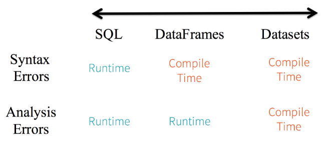 
- High-level abstraction and custom view into structured and semi-structured data:

DataFrames as a collection of Datasets[Row] render a structured custom view into your semi-structured data.

`// read the json file and create the dataset from the` 
`// case class DeviceIoTData
// ds is now a collection of JVM Scala objects DeviceIoTData
val ds = spark.read.json(“/databricks-public-datasets/data/iot/iot_devices.json”).as[DeviceIoTData]`

Three things happen here under the hood in the code above:

    - Spark reads the JSON, infers the schema, and creates a collection of DataFrames.
    - At this point, Spark converts your data into DataFrame = Dataset[Row], a collection of generic Row object, 
    - since it does not know the exact type.

Now, Spark converts the Dataset[Row] -> Dataset[DeviceIoTData] type-specific Scala JVM object, as dictated by the class 
DeviceIoTData. Most of us have who work with structured data are accustomed to viewing and processing data in either 
columnar manner or accessing specific attributes within an object. With Dataset as a collection of Dataset[ElementType] 
typed objects, you seamlessly get both compile-time safety and custom view for strongly-typed JVM objects. And your 
resulting strongly-typed Dataset[T] from above code can be easily displayed or processed with high-level methods.

- Ease-of-use of APIs with structureThree things happen here under the hood in the code above:

Although structure may limit control in what your Spark program can do with data, it introduces rich semantics and an 
easy set of domain specific operations that can be expressed as high-level constructs. Most computations, however, can 
be accomplished with Dataset’s high-level APIs. For example, it’s much simpler to perform agg, select, sum, avg, map, 
filter, or groupBy operations by accessing a Dataset typed object’s DeviceIoTData than using RDD rows’ data fields.
Expressing your computation in a domain specific API is far simpler and easier than with relation algebra type 
expressions (in RDDs). For instance, the code below will filter() and  map() create another immutable Dataset.

- Performance and Optimization:

Along with all the above benefits, you cannot overlook the space efficiency and performance gains in using DataFrames 
and Dataset APIs for two reasons.

First, because DataFrame and Dataset APIs are built on top of the Spark SQL engine, it uses Catalyst to generate an 
optimized logical and physical query plan. Across R, Java, Scala, or Python DataFrame/Dataset APIs, all relation type
 queries undergo the same code optimizer, providing the space and speed efficiency. Whereas the Dataset[T] typed API is 
optimized for data engineering tasks, the untyped Dataset[Row] (an alias of DataFrame) is even faster and suitable for
interactive analysis.   

Second, since Spark as a compiler understands your Dataset type JVM object, it maps your type-specific JVM object to 
Tungsten’s internal memory representation using Encoders. As a result, Tungsten Encoders can efficiently 
serialize/deserialize JVM objects as well as generate compact bytecode that can execute at superior speeds. 

#### When should I use DataFrames or Datasets?
- If you want rich semantics, high-level abstractions, and domain specific APIs, use DataFrame or Dataset.
- If your processing demands high-level expressions, filters, maps, aggregation, averages, sum, SQL queries, columnar 
access and use of lambda functions on semi-structured data, use DataFrame or Dataset.
- If you want higher degree of type-safety at compile time, want typed JVM objects, take advantage of Catalyst 
optimization, and benefit from Tungsten’s efficient code generation, use Dataset.
- If you want unification and simplification of APIs across Spark Libraries, use DataFrame or Dataset.
- If you are a R user, use DataFrames.
- If you are a Python user, use DataFrames and resort back to RDDs if you need more control.

Note that you can always seamlessly interoperate or convert from DataFrame and/or Dataset to an RDD, by simple method 
call '.rdd'. 

##### Performance tuning for spark sql

###### Caching Data In Memory: 
Spark SQL can cache tables using an in-memory columnar format by calling spark.catalog.cacheTable("tableName") or 
dataFrame.cache(). Then Spark SQL will scan only required columns and will automatically tune compression to minimize 
memory usage and GC pressure. You can call spark.catalog.uncacheTable("tableName") to remove the table from memory.

Configuration of in-memory caching can be done using the setConf method on SparkSession or by running SET key=value 
commands using SQL.

- `spark.sql.inMemoryColumnarStorage.compressed`: The default value is true. When set to true Spark SQL will 
automatically select a compression codec for each column based on statistics of the data.
- `spark.sql.inMemoryColumnarStorage.batchSize`: The default value is 10000. Controls the size of batches for columnar 
caching. Larger batch sizes can improve memory utilization and compression, but risk OOMs when caching data.

 
###### Other Configuration Options:

The following options can also be used to tune the performance of query execution. It is possible that these options 
will be deprecated in future release as more optimizations are performed automatically.

- `spark.sql.files.maxPartitionBytes`: The default value is 128MB. The maximum number of bytes to pack into a single 
partition when reading files.
- `spark.sql.files.openCostInBytes`: The default value is 4MB. The estimated cost to open a file, measured by the number
 of bytes could be scanned in the same time. This is used when putting multiple files into a partition. It is better to
 over-estimated, then the partitions with small files will be faster than partitions with bigger files 
 (which is scheduled first).
- `spark.sql.broadcastTimeout`: The default is 300. Timeout in seconds for the broadcast wait time in broadcast joins
- `spark.sql.autoBroadcastJoinThreshold`: The default is 10MB. Configures the maximum size in bytes for a table that 
will be broadcast to all worker nodes when performing a join. By setting this value to -1 broadcasting can be disabled. 
Note that currently statistics are only supported for Hive Metastore tables where the command ANALYZE TABLE <tableName> 
COMPUTE STATISTICS noscan has been run.
- `spark.sql.shuffle.partitions`: The default is 200. Configures the number of partitions to use when shuffling data for
 joins or aggregations.
 
## Spark Streaming

Table of content:
- Intro & overview
- Dstreams
- Input Dstreams and Receivers
- Basic Sources & Advance sources
- Transformations on Dstreams
- Output operations on Dstreams
- Dataframe and SQL Operations
- Caching/ Persistence 
- Checkpointing
- Window operations
- Performance tuning 

Spark Streaming is an extension of the core Spark API that enables scalable, high-throughput, fault-tolerant stream 
processing of live data streams. Data can be ingested from many sources like Kafka, Kinesis, or TCP sockets, and can be 
processed using complex algorithms expressed with high-level functions like map, reduce, join and window. Finally, 
processed data can be pushed out to filesystems, databases, and live dashboards. In fact, you can apply Spark’s machine 
learning and graph processing algorithms on data streams.
 
 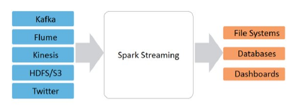
 
Internally, it works as follows. Spark Streaming receives live input data streams and divides the data into batches, 
which are then processed by the Spark engine to generate the final stream of results in batches.

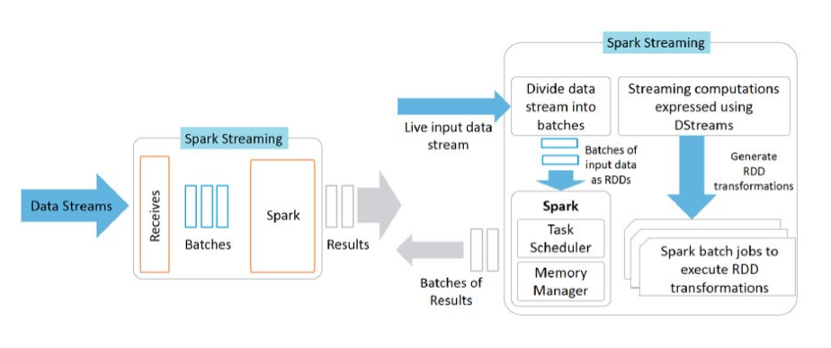
 
Spark Streaming provides a high-level abstraction called discretized stream or DStream, which represents a continuous 
stream of data. DStreams can be created either from input data streams from sources such as Kafka, and Kinesis, or by 
applying high-level operations on other DStreams. Internally, a DStream is represented as a sequence of RDDs.

##### Discretized Streams (DStreams)

Discretized Stream or DStream is the basic abstraction provided by Spark Streaming. It represents a continuous stream of
data, either the input data stream received from source, or the processed data stream generated by transforming the 
input stream. Internally, a DStream is represented by a continuous series of RDDs, which is Spark’s abstraction of an 
immutable, distributed dataset. Each RDD in a DStream contains data from a certain interval, as shown in the following 
figure.

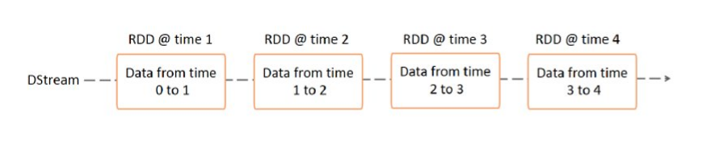

Any operation applied on a DStream translates to operations on the underlying RDDs. For example, in the earlier example 
of converting a stream of lines to words, the flatMap operation is applied on each RDD in the lines DStream to generate 
the RDDs of the words DStream. This is shown in the following figure.

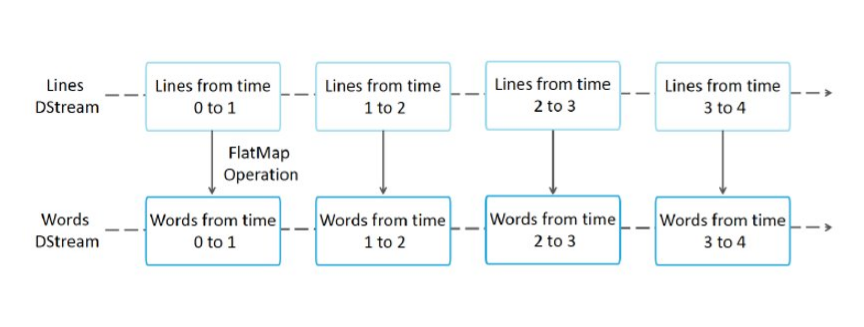

These underlying RDD transformations are computed by the Spark engine. The DStream operations hide most of these details
 and provide the developer with a higher-level API for convenience. These operations are discussed in detail in later 
sections.

##### Input DStreams and Receivers
Input DStreams represent the input data stream received from streaming sources. Except file stream, each input DStream 
is linked with a receiver object that stores the data received from a source. 

Spark Streaming provides two categories of built-in streaming sources.

Basic sources: Sources directly available in the StreamingContext API. Examples: file systems, and socket connections.

Advanced sources: Sources like Kafka, Kinesis, etc. are available through extra utility classes. These require linking 
against extra dependencies as discussed in the linking section.

Note that, if you want to receive multiple streams of data in parallel in your streaming application, you can create 
multiple input DStreams (discussed further in the Performance Tuning section). This will create multiple receivers which
 will simultaneously receive multiple data streams. But note that a Spark worker/executor is a long-running task, hence 
it occupies one of the cores allocated to the Spark Streaming application. Therefore, it is important to remember that 
a Spark Streaming application needs to be allocated enough cores (or threads, if running locally) to process the 
received data, as well as to run the receiver(s).

###### Points to remember
- When running a Spark Streaming program locally, do not use “local” or “local[1]” as the master URL. Either of these 
means that only one thread will be used for running tasks locally. If you are using an input DStream based on a receiver
 (e.g. sockets, Kafka, etc.), then the single thread will be used to run the receiver, leaving no thread for processing 
 the received data. Hence, when running locally, always use “local[n]” as the master URL, where n > number of receivers
  to run.

- Extending the logic to running on a cluster, the number of cores allocated to the Spark Streaming application must be 
more than the number of receivers. Otherwise the system will receive data, but not be able to process it.

##### Basic Sources
File streams:
For reading data from files on any file system compatible with the HDFS API (that is, HDFS, S3, NFS, etc.), a DStream
can be created as via StreamingContext.fileStream[KeyClass, ValueClass, InputFormatClass].

File streams do not require running a receiver so there is no need to allocate any cores for receiving file data.

Syntax:  
`streamingContext.fileStream[keyClass, ValueClass](dataDirectory)` 
`streamingContext.textFileStream(dataDirectory)`

###### How Directories are Monitored
Spark Streaming will monitor the directory dataDirectory and process any files created in that directory.
- A simple directory can be monitored, such as "hdfs://namenode:8040/logs/". All files directly under such a path will 
be processed as they are discovered.
- A POSIX glob pattern can be supplied, such as "hdfs://namenode:8040/logs/2017/*". Here, the DStream will consist of 
all files in the directories matching the pattern. That is: it is a pattern of directories, not of files in directories.
- All files must be in the same data format.
- A file is considered part of a time period based on its modification time, not its creation time.
- Once processed, changes to a file within the current window will not cause the file to be reread. That is: updates are
 ignored.
- The more files under a directory, the longer it will take to scan for changes — even if no files have been modified.
- If a wildcard is used to identify directories, such as "hdfs://namenode:8040/logs/2016-*", renaming an entire 
directory to match the path will add the directory to the list of monitored directories. Only the files in the directory
 whose modification time is within the current window will be included in the stream.
- Calling FileSystem.setTimes() to fix the timestamp is a way to have the file picked up in a later window, even if its 
contents have not changed.

###### Using Object Stores as a source of data
“Full” Filesystems such as HDFS tend to set the modification time on their files as soon as the output stream is 
created. When a file is opened, even before data has been completely written, it may be included in the DStream - after 
which updates to the file within the same window will be ignored. That is: changes may be missed, and data omitted from
the stream.

To guarantee that changes are picked up in a window, write the file to an unmonitored directory, then, immediately after
 the output stream is closed, rename it into the destination directory. Provided the renamed file appears in the scanned
destination directory during the window of its creation, the new data will be picked up.

In contrast, Object Stores such as Amazon S3 and Azure Storage usually have slow rename operations, as the data is 
actually copied. Furthermore, renamed object may have the time of the rename() operation as its modification time, so 
may not be considered part of the window which the original create time implied they were.

Careful testing is needed against the target object store to verify that the timestamp behavior of the store is 
consistent with that expected by Spark Streaming. It may be that writing directly into a destination directory is the 
appropriate strategy for streaming data via the chosen object store.

###### Streams based on Custom Receivers
DStreams can be created with data streams received through custom receivers. 

###### Queue of RDDs as a Stream
For testing a Spark Streaming application with test data, one can also create a DStream based on a queue of RDDs, 
using streamingContext.queueStream(queueOfRDDs). Each RDD pushed into the queue will be treated as a batch of data in 
the DStream, and processed like a stream.

##### Advance Sources
This category of sources requires interfacing with external non-Spark libraries, some of them with complex dependencies 
(e.g., Kafka). Hence, to minimize issues related to version conflicts of dependencies, the functionality to create 
DStreams from these sources has been moved to separate libraries that can be linked to explicitly when necessary.

Note that these advanced sources are not available in the Spark shell, hence applications based on these advanced 
sources cannot be tested in the shell. If you really want to use them in the Spark shell you will have to download the 
corresponding Maven artifact’s JAR along with its dependencies and add it to the classpath.

Some of these advanced sources are as follows.

- Kafka: Spark Streaming 3.1.2 is compatible with Kafka broker versions 0.10 or higher.
- Kinesis: Spark Streaming 3.1.2 is compatible with Kinesis Client Library 1.2.1. 
- Flume
- Twitter

##### Receiver Reliability
There can be two kinds of data sources based on their reliability. Sources (like Kafka) allow the transferred data to be
 acknowledged. If the system receiving data from these reliable sources acknowledges the received data correctly,
it can be ensured that no data will be lost due to any kind of failure. This leads to two kinds of receivers:

- Reliable Receiver - A reliable receiver correctly sends acknowledgment to a reliable source when the data has been 
received and stored in Spark with replication.
- Unreliable Receiver - An unreliable receiver does not send acknowledgment to a source. This can be used for sources 
that do not support acknowledgment, or even for reliable sources when one does not want or need to go into the 
complexity of acknowledgment.

##### Transformations on DStreams
Transformations on DStreams are similar to those of RDD's. A few of the common transformations on DStreams are given in
the table below:

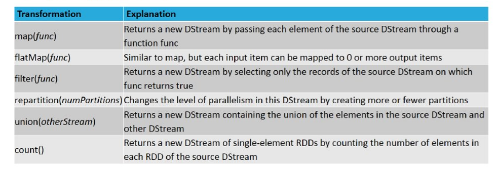

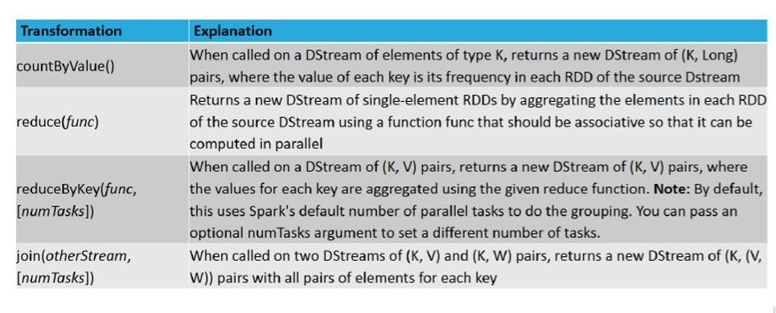

##### Output operations on DStreams
Output operations on DStreams let the data of DStreams to be pushed to external systems. They trigger the real 
executions of all the Dstreams transformations. These are given in the table below: 

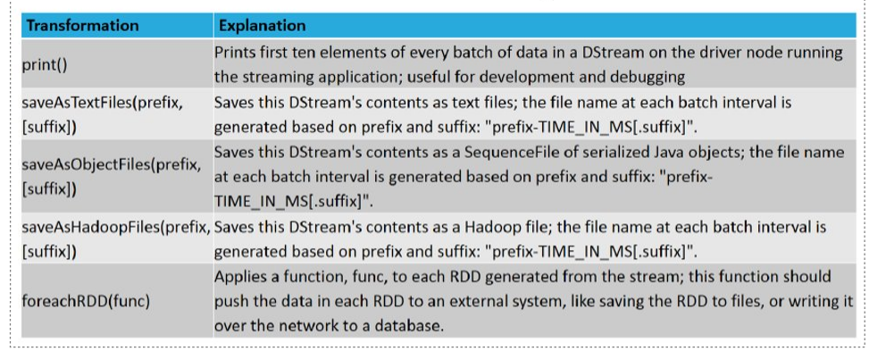

##### DataFrame and SQL Operations
We easily use DataFrames and SQL operations on streaming data. We have to create a SparkSession using the 
SparkContext that the StreamingContext is using. Furthermore, this has to done such that it can be restarted on driver 
failures. This is done by creating a lazily instantiated singleton instance of SparkSession. This is shown in the 
following example. It modifies the earlier word count example to generate word counts using DataFrames and SQL. Each 
RDD is converted to a DataFrame, registered as a temporary table and then queried using SQL.

    import sys
    from pyspark import SparkContext
    from pyspark.streaming import StreamingContext
    from pyspark.sql import Row, SparkSession

    def getSparkSessionInstance(sparkConf):
        if ('sparkSessionSingletonInstance' not in globals()):
            globals()['sparkSessionSingletonInstance'] = SparkSession\
                .builder\
                .config(conf=sparkConf)\
                .getOrCreate()
        return globals()['sparkSessionSingletonInstance']

    if __name__ == "__main__":
        if len(sys.argv) != 3:
            print("Usage: sql_network_wordcount.py <hostname> <port> ", file=sys.stderr)
            sys.exit(-1)
        host, port = sys.argv[1:]
        sc = SparkContext(appName="PythonSqlNetworkWordCount")
        ssc = StreamingContext(sc, 1)
    
        # Create a socket stream on target ip:port and count the
        # words in input stream of \n delimited text (e.g. generated by 'nc')
        lines = ssc.socketTextStream(host, int(port))
        words = lines.flatMap(lambda line: line.split(" "))
    
        # Convert RDDs of the words DStream to DataFrame and run SQL query
        def process(time, rdd):
            print("========= %s =========" % str(time))
    
            try:
                # Get the singleton instance of SparkSession
                spark = getSparkSessionInstance(rdd.context.getConf())
    
                # Convert RDD[String] to RDD[Row] to DataFrame
                rowRdd = rdd.map(lambda w: Row(word=w))
                wordsDataFrame = spark.createDataFrame(rowRdd)
    
                # Creates a temporary view using the DataFrame.
                wordsDataFrame.createOrReplaceTempView("words")
    
                # Do word count on table using SQL and print it
                wordCountsDataFrame = \
                    spark.sql("select word, count(*) as total from words group by word")
                wordCountsDataFrame.show()
            except:
                pass
    
        words.foreachRDD(process)
        ssc.start()
        ssc.awaitTermination()`
        
        
We can also run SQL queries on tables defined on streaming data from a different thread (that is, asynchronous to the 
running StreamingContext). Just make sure that you set the StreamingContext to remember a sufficient amount of streaming
data such that the query can run. Otherwise the StreamingContext, which is unaware of the any asynchronous SQL queries, 
will delete off old streaming data before the query can complete. For example, if you want to query the last batch, 
but your query can take 5 minutes to run, then call streamingContext.remember(Minutes(5)) 
(in Scala, or equivalent in other languages). 

##### Caching / Persistence
Similar to RDDs, DStreams also allow developers to persist the stream’s data in memory. That is, using the persist() 
method on a DStream will automatically persist every RDD of that DStream in memory. This is useful if the data in the 
DStream will be computed multiple times (e.g., multiple operations on the same data). For window-based operations like 
reduceByWindow and reduceByKeyAndWindow and state-based operations like updateStateByKey, this is implicitly true. 
Hence, DStreams generated by window-based operations are automatically persisted in memory, without the developer 
calling persist().

For input streams that receive data over the network (such as, Kafka, sockets, etc.), the default persistence level is 
set to replicate the data to two nodes for fault-tolerance.   

##### Checkpointing
A streaming application must operate 24/7 and hence must be resilient to failures unrelated to the application logic 
(e.g., system failures, JVM crashes, etc.). For this to be possible, Spark Streaming needs to checkpoint enough 
information to a fault- tolerant storage system such that it can recover from failures. There are two types of data 
that are check pointed.

- Metadata checkpointing - Saving of the information defining the streaming computation to fault-tolerant storage like 
HDFS. This is used to recover from failure of the node running the driver of the streaming application 
(discussed in detail later). 
    Metadata includes:
    -   Configuration - The configuration that was used to create the streaming application.
        DStream operations - The set of DStream operations that define the streaming application.
    -   Incomplete batches - Batches whose jobs are queued but have not completed yet.
    -   Data checkpointing - Saving of the generated RDDs to reliable storage. This is necessary in some stateful 
    transformations that combine data across multiple batches. In such transformations, the generated RDDs depend on 
    RDDs of previous batches, which causes the length of the dependency chain to keep increasing with time. 
    To avoid such unbounded increases in recovery time (proportional to dependency chain), intermediate RDDs of stateful
    transformations are periodically checkpointed to reliable storage (e.g. HDFS) to cut off the dependency chains.

To summarize, metadata checkpointing is primarily needed for recovery from driver failures, whereas data or RDD 
checkpointing is necessary even for basic functioning if stateful transformations are used. 

###### When to enable Checkpointing
Checkpointing must be enabled for applications with any of the following requirements:

- Usage of stateful transformations - If either updateStateByKey or reduceByKeyAndWindow (with inverse function) is 
used in the application, then the checkpoint directory must be provided to allow for periodic RDD checkpointing.
- Recovering from failures of the driver running the application - Metadata checkpoints are used to recover with 
progress information.

##### Window operations
Window operations let you implement transformations over a sliding window of data.

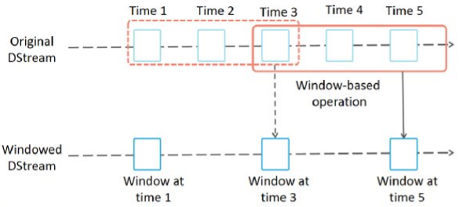

###### Type of window operations
Some of the general window operations are listed in the below table. All these operations take window length and slide 
interval as parameters.

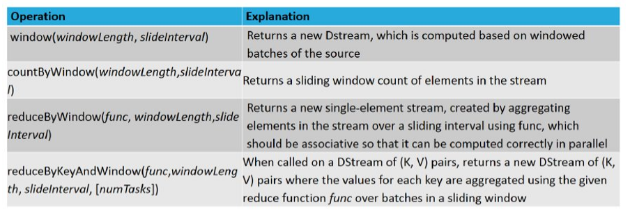

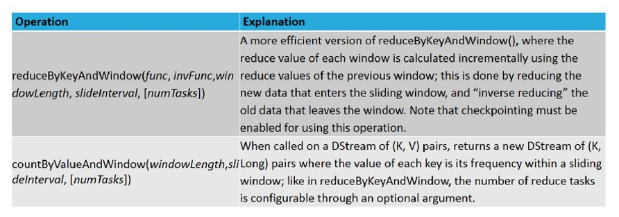

##### Performance Tuning
Getting the best performance out of a Spark Streaming application on a cluster requires a bit of tuning. This section 
explains a number of the parameters and configurations that can be tuned to improve the performance of you application. 
At a high level, you need to consider two things:

- Reducing the processing time of each batch of data by efficiently using cluster resources.

- Setting the right batch size such that the batches of data can be processed as fast as they are received 
(that is, data processing keeps up with the data ingestion).

At details level, one has to consider the following parameters and configurations:

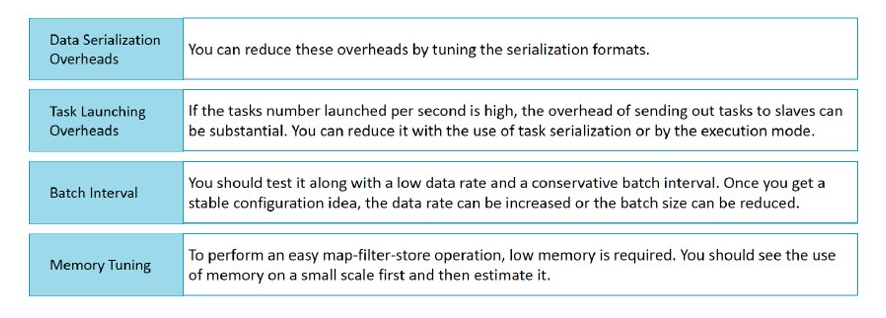

## Sparks Graphs/GraphX

Table of Content:
- Intro & overview
- Property graph
- Graph operators
    - Summary list of operators
    - Neighborhood Aggregations
        - Map reduce Triplets 
- Caching and Uncaching

GraphX is a new component in Spark for graphs and graph-parallel computation. At a high level, GraphX extends the Spark 
RDD by introducing a new Graph abstraction: a directed multigraph with properties attached to each vertex and edge. To 
support graph computation, GraphX exposes a set of fundamental operators (e.g., subgraph, joinVertices, and 
aggregateMessages) as well as an optimized variant of the Pregel API. In addition, GraphX includes a growing collection 
of graph algorithms and builders to simplify graph analytics tasks.

### Property Graph
The property graph is a directed multigraph with user defined objects attached to each vertex and edge. A directed 
multigraph is a directed graph with potentially multiple parallel edges sharing the same source and destination vertex. 
The ability to support parallel edges simplifies modeling scenarios where there can be multiple relationships 
(e.g., co-worker and friend) between the same vertices. Each vertex is keyed by a unique 64-bit long identifier 
(VertexId). GraphX does not impose any ordering constraints on the vertex identifiers. Similarly, edges have 
corresponding source and destination vertex identifiers.

The property graph is parameterized over the vertex (VD) and edge (ED) types. These are the types of the objects 
associated with each vertex and edge respectively.

GraphX optimizes the representation of vertex and edge types when they are primitive data types 
(e.g., int, double, etc…) reducing the in memory footprint by storing them in specialized arrays.

In some cases it may be desirable to have vertices with different property types in the same graph. This can be 
accomplished through inheritance. For example to model users and products as a bipartite graph we might do the 
following:

    `class VertexProperty()
     case class UserProperty(val name: String) extends VertexProperty
     case class ProductProperty(val name: String, val price: Double) extends VertexProperty
     // The graph might then have the type:
     var graph: Graph[VertexProperty, String] = null`

Like RDDs, property graphs are immutable, distributed, and fault-tolerant. Changes to the values or structure of the 
graph are accomplished by producing a new graph with the desired changes. Note that substantial parts of the original 
graph (i.e., unaffected structure, attributes, and indices) are reused in the new graph reducing the cost of this 
inherently functional data structure. The graph is partitioned across the executors using a range of vertex partitioning
heuristics. As with RDDs, each partition of the graph can be recreated on a different machine in the event of a failure.

Logically the property graph corresponds to a pair of typed collections (RDDs) encoding the properties for each vertex 
and edge. As a consequence, the graph class contains members to access the vertices and edges of the graph:

    `class Graph[VD, ED] {
     val vertices: VertexRDD[VD]
     val edges: EdgeRDD[ED]
     }`

The classes VertexRDD[VD] and EdgeRDD[ED] extend and are optimized versions of RDD[(VertexId, VD)] and RDD[Edge[ED]] 
respectively. Both VertexRDD[VD] and EdgeRDD[ED] provide additional functionality built around graph computation and 
leverage internal optimizations.

### Graph Operators
Just as RDDs have basic operations like map, filter, and reduceByKey, property graphs also have a collection of basic 
operators that take user defined functions and produce new graphs with transformed properties and structure. 
The core operators that have optimized implementations are defined in Graph and convenient operators that are expressed 
as a compositions of the core operators are defined in GraphOps.

###### Summary List of Operators

       `/** Summary of the functionality in the property graph */
    class Graph[VD, ED] {
      // Information about the Graph ===================================================================
      val numEdges: Long
      val numVertices: Long
      val inDegrees: VertexRDD[Int]
      val outDegrees: VertexRDD[Int]
      val degrees: VertexRDD[Int]
      // Views of the graph as collections =============================================================
      val vertices: VertexRDD[VD]
      val edges: EdgeRDD[ED]
      val triplets: RDD[EdgeTriplet[VD, ED]]
      // Functions for caching graphs ==================================================================
      def persist(newLevel: StorageLevel = StorageLevel.MEMORY_ONLY): Graph[VD, ED]
      def cache(): Graph[VD, ED]
      def unpersistVertices(blocking: Boolean = false): Graph[VD, ED]
      // Change the partitioning heuristic  ============================================================
      def partitionBy(partitionStrategy: PartitionStrategy): Graph[VD, ED]
      // Transform vertex and edge attributes ==========================================================
      def mapVertices[VD2](map: (VertexId, VD) => VD2): Graph[VD2, ED]
      def mapEdges[ED2](map: Edge[ED] => ED2): Graph[VD, ED2]
      def mapEdges[ED2](map: (PartitionID, Iterator[Edge[ED]]) => Iterator[ED2]): Graph[VD, ED2]
      def mapTriplets[ED2](map: EdgeTriplet[VD, ED] => ED2): Graph[VD, ED2]
      def mapTriplets[ED2](map: (PartitionID, Iterator[EdgeTriplet[VD, ED]]) => Iterator[ED2])
        : Graph[VD, ED2]
      // Modify the graph structure ====================================================================
      def reverse: Graph[VD, ED]
      def subgraph(
          epred: EdgeTriplet[VD,ED] => Boolean = (x => true),
          vpred: (VertexId, VD) => Boolean = ((v, d) => true))
        : Graph[VD, ED]
      def mask[VD2, ED2](other: Graph[VD2, ED2]): Graph[VD, ED]
      def groupEdges(merge: (ED, ED) => ED): Graph[VD, ED]
      // Join RDDs with the graph ======================================================================
      def joinVertices[U](table: RDD[(VertexId, U)])(mapFunc: (VertexId, VD, U) => VD): Graph[VD, ED]
      def outerJoinVertices[U, VD2](other: RDD[(VertexId, U)])
          (mapFunc: (VertexId, VD, Option[U]) => VD2)
        : Graph[VD2, ED]
      // Aggregate information about adjacent triplets =================================================
      def collectNeighborIds(edgeDirection: EdgeDirection): VertexRDD[Array[VertexId]]
      def collectNeighbors(edgeDirection: EdgeDirection): VertexRDD[Array[(VertexId, VD)]]
      def aggregateMessages[Msg: ClassTag](
          sendMsg: EdgeContext[VD, ED, Msg] => Unit,
          mergeMsg: (Msg, Msg) => Msg,
          tripletFields: TripletFields = TripletFields.All)
        : VertexRDD[A]
      // Iterative graph-parallel computation ==========================================================
      def pregel[A](initialMsg: A, maxIterations: Int, activeDirection: EdgeDirection)(
          vprog: (VertexId, VD, A) => VD,
          sendMsg: EdgeTriplet[VD, ED] => Iterator[(VertexId, A)],
          mergeMsg: (A, A) => A)
        : Graph[VD, ED]
      // Basic graph algorithms ========================================================================
      def pageRank(tol: Double, resetProb: Double = 0.15): Graph[Double, Double]
      def connectedComponents(): Graph[VertexId, ED]
      def triangleCount(): Graph[Int, ED]
      def stronglyConnectedComponents(numIter: Int): Graph[VertexId, ED]
    }` 

##### Neighborhood Aggregation
A key step in many graph analytics tasks is aggregating information about the neighborhood of each vertex. For example,
we might want to know the number of followers each user has or the average age of the followers of each user. Many 
iterative graph algorithms (e.g., PageRank, Shortest Path, and connected components) repeatedly aggregate properties of 
neighboring vertices (e.g., current PageRank Value, shortest path to the source, and smallest reachable vertex id).

###### Aggregate Messages (aggregateMessages)
The core aggregation operation in GraphX is aggregateMessages. This operator applies a user defined sendMsg function to 
each edge triplet in the graph and then uses the mergeMsg function to aggregate those messages at their destination 
vertex.

    `class Graph[VD, ED] {
     def aggregateMessages[Msg: ClassTag](
         sendMsg: EdgeContext[VD, ED, Msg] => Unit,
         mergeMsg: (Msg, Msg) => Msg,
         tripletFields: TripletFields = TripletFields.All)
         : VertexRDD[Msg]
     }`
  
###### Map Reduce Triplets Transition Guide (Legacy)
In earlier versions of GraphX neighborhood aggregation was accomplished using the mapReduceTriplets operator:

`class Graph[VD, ED] {
  def mapReduceTriplets[Msg](
      map: EdgeTriplet[VD, ED] => Iterator[(VertexId, Msg)],
      reduce: (Msg, Msg) => Msg)
    : VertexRDD[Msg]
}`   

##### Caching and Uncaching
In Spark, RDDs are not persisted in memory by default. To avoid recomputation, they must be explicitly cached when using
 them multiple times (see the Spark Programming Guide). Graphs in GraphX behave the same way. When using a graph 
multiple times, make sure to call Graph.cache() on it first.

In iterative computations, uncaching may also be necessary for best performance. By default, cached RDDs and graphs will
 remain in memory until memory pressure forces them to be evicted in LRU order. For iterative computation, intermediate 
results from previous iterations will fill up the cache. Though they will eventually be evicted, the unnecessary data 
stored in memory will slow down garbage collection. It would be more efficient to uncache intermediate results as soon 
as they are no longer necessary. This involves materializing (caching and forcing) a graph or RDD every iteration, 
uncaching all other datasets, and only using the materialized dataset in future iterations. However, because graphs are 
composed of multiple RDDs, it can be difficult to unpersist them correctly. For iterative computation we recommend using
the Pregel API, which correctly unpersists intermediate results.

## Spark MLib

Table of content:
- Basic statistics
    - correlation
    - Hypothesis testing
        - Chisquare test
    - summarizer
- Data sources
- Pipelines
    - Overview
    - Dataframes
    - Pipeline components
    - Pipeline
        - How it works
        - Details
        - Parameters
       

MLlib is Spark’s machine learning (ML) library. Its goal is to make practical machine learning scalable and easy. At a 
high level, it provides tools such as:

- ML Algorithms: common learning algorithms such as classification, regression, clustering, and collaborative filtering
- Featurization: feature extraction, transformation, dimensionality reduction, and selection
- Pipelines: tools for constructing, evaluating, and tuning ML Pipelines
- Persistence: saving and load algorithms, models, and Pipelines
- Utilities: linear algebra, statistics, data handling, etc.

##### Basic Statistics

- Correlation: Calculating the correlation between two series of data is a common operation in Statistics. In spark.ml 
we provide the flexibility to calculate pairwise correlations among many series. The supported correlation methods are 
currently Pearson’s and Spearman’s correlation.

Python code:

     from pyspark.ml.linalg import Vectors
     from pyspark.ml.stat import Correlation
     data = [(Vectors.sparse(4, [(0, 1.0), (3, -2.0)]),),
         (Vectors.dense([4.0, 5.0, 0.0, 3.0]),),
         (Vectors.dense([6.0, 7.0, 0.0, 8.0]),),
         (Vectors.sparse(4, [(0, 9.0), (3, 1.0)]),)]
     df = spark.createDataFrame(data, ["features"])

     r1 = Correlation.corr(df, "features").head()
     print("Pearson correlation matrix:\n" + str(r1[0]))

     r2 = Correlation.corr(df, "features", "spearman").head()
     print("Spearman correlation matrix:\n" + str(r2[0]))
     
- Hypothesis testing: Hypothesis testing is a powerful tool in statistics to determine whether a result is statistically
 significant, whether this result occurred by chance or not. spark.ml currently supports Pearson’s Chi-squared ( χ2) 
 tests for independence.
 
    - ChiSquareTest: ChiSquareTest conducts Pearson’s independence test for every feature against the label. For each 
    feature, the (feature, label) pairs are converted into a contingency matrix for which the Chi-squared statistic is 
    computed. All label and feature values must be categorical.

Python Code: 

     from pyspark.ml.linalg import Vectors
     from pyspark.ml.stat import ChiSquareTest

     data = [(0.0, Vectors.dense(0.5, 10.0)),
         (0.0, Vectors.dense(1.5, 20.0)),
         (1.0, Vectors.dense(1.5, 30.0)),
         (0.0, Vectors.dense(3.5, 30.0)),
         (0.0, Vectors.dense(3.5, 40.0)),
         (1.0, Vectors.dense(3.5, 40.0))]
     df = spark.createDataFrame(data, ["label", "features"])

     r = ChiSquareTest.test(df, "features", "label").head()
     print("pValues: " + str(r.pValues))
     print("degreesOfFreedom: " + str(r.degreesOfFreedom))
     print("statistics: " + str(r.statistics))

- Summarizer: We provide vector column summary statistics for Dataframe through Summarizer. Available metrics are the 
column-wise max, min, mean, sum, variance, std, and number of nonzeros, as well as the total count.

    
    from pyspark.ml.stat import Summarizer
    from pyspark.sql import Row
    from pyspark.ml.linalg import Vectors

    df = sc.parallelize([Row(weight=1.0, features=Vectors.dense(1.0, 1.0, 1.0)),
                     Row(weight=0.0, features=Vectors.dense(1.0, 2.0, 3.0))]).toDF()

    # create summarizer for multiple metrics "mean" and "count"
    summarizer = Summarizer.metrics("mean", "count")

    # compute statistics for multiple metrics with weight
    df.select(summarizer.summary(df.features, df.weight)).show(truncate=False)

    # compute statistics for multiple metrics without weight
    df.select(summarizer.summary(df.features)).show(truncate=False)
    
    # compute statistics for single metric "mean" with weight
    df.select(Summarizer.mean(df.features, df.weight)).show(truncate=False)
    
    # compute statistics for single metric "mean" without weight
    df.select(Summarizer.mean(df.features)).show(truncate=False)`
    
##### Data sources
Besides some general data sources such as Parquet, CSV, JSON and JDBC, spark Mlib also provide some specific data 
sources for ML.

- Image data source: This image data source is used to load image files from a directory, it can load compressed image
 (jpeg, png, etc.) into raw image representation via ImageIO in Java library. The loaded DataFrame has one StructType 
 column: “image”, containing image data stored as image schema. The schema of the image column is:

    - origin: StringType (represents the file path of the image)
    - height: IntegerType (height of the image)
    - width: IntegerType (width of the image)
    - nChannels: IntegerType (number of image channels)
    - mode: IntegerType (OpenCV-compatible type)
    - data: BinaryType (Image bytes in OpenCV-compatible order: row-wise BGR in most cases)
    
    Python Code:
    
    
    >>> df = spark.read.format("image").option("dropInvalid", True).load("data/mllib/images/origin/kittens")
    >>> df.select("image.origin", "image.width", "image.height").show(truncate=False)
    +-----------------------------------------------------------------------+-----+------+
    |origin                                                                 |width|height|
    +-----------------------------------------------------------------------+-----+------+
    |file:///spark/data/mllib/images/origin/kittens/54893.jpg               |300  |311   |
    |file:///spark/data/mllib/images/origin/kittens/DP802813.jpg            |199  |313   |
    |file:///spark/data/mllib/images/origin/kittens/29.5.a_b_EGDP022204.jpg |300  |200   |
    |file:///spark/data/mllib/images/origin/kittens/DP153539.jpg            |300  |296   |
    +-----------------------------------------------------------------------+-----+------+    
        
- LIBSVM data source: This LIBSVM data source is used to load ‘libsvm’ type files from a directory. The loaded DataFrame
 has two columns: label containing labels stored as doubles and features containing feature vectors stored as Vectors. 
 The schemas of the columns are:

    - label: DoubleType (represents the instance label)
    - features: VectorUDT (represents the feature vector)
    
    Python code:
    
    
    >>> df = spark.read.format("libsvm").option("numFeatures", "780").load("data/mllib/sample_libsvm_data.txt")
    >>> df.show(10)
    +-----+--------------------+
    |label|            features|
    +-----+--------------------+
    |  0.0|(780,[127,128,129...|
    |  1.0|(780,[158,159,160...|
    |  1.0|(780,[124,125,126...|
    |  1.0|(780,[152,153,154...|
    |  1.0|(780,[151,152,153...|
    |  0.0|(780,[129,130,131...|
    |  1.0|(780,[158,159,160...|
    |  1.0|(780,[99,100,101,...|
    |  0.0|(780,[154,155,156...|
    |  0.0|(780,[127,128,129...|
    +-----+--------------------+
    only showing top 10 rows
    
##### ML Pipelines:

ML Pipelines provide a uniform set of high-level APIs built on top of DataFrames that help users create and tune 
practical machine learning pipelines.

##### Main concepts in Pipelines
MLlib standardizes APIs for machine learning algorithms to make it easier to combine multiple algorithms into a single 
pipeline, or workflow. This section covers the key concepts introduced by the Pipelines API, where the pipeline concept 
is mostly inspired by the scikit-learn project.

- DataFrame: This ML API uses DataFrame from Spark SQL as an ML dataset, which can hold a variety of data types. E.g., 
a DataFrame could have different columns storing text, feature vectors, true labels, and predictions.

- Transformer: A Transformer is an algorithm which can transform one DataFrame into another DataFrame. E.g., an ML 
model is a Transformer which transforms a DataFrame with features into a DataFrame with predictions.

- Estimator: An Estimator is an algorithm which can be fit on a DataFrame to produce a Transformer. E.g., a learning 
algorithm is an Estimator which trains on a DataFrame and produces a model.

- Pipeline: A Pipeline chains multiple Transformers and Estimators together to specify an ML workflow.

Parameter: All Transformers and Estimators now share a common API for specifying parameters

##### DataFrame
Machine learning can be applied to a wide variety of data types, such as vectors, text, images, and structured data. 
This API adopts the DataFrame from Spark SQL in order to support a variety of data types. DataFrame supports many basic 
and structured types; A DataFrame can be created either implicitly or explicitly from a regular RDD. Columns in a 
DataFrame are named. The code examples below use names such as “text”, “features”, and “label”.

##### Pipeline components

- Transformers: A Transformer is an abstraction that includes feature transformers and learned models. Technically, a 
Transformer implements a method transform(), which converts one DataFrame into another, generally by appending one or 
more columns. For example:

    - A feature transformer might take a DataFrame, read a column (e.g., text), map it into a new column 
    (e.g., feature vectors), and output a new DataFrame with the mapped column appended.
    - A learning model might take a DataFrame, read the column containing feature vectors, predict the label for each 
    feature vector, and output a new DataFrame with predicted labels appended as a column.

- Estimators: An Estimator abstracts the concept of a learning algorithm or any algorithm that fits or trains on data. 
Technically, an Estimator implements a method fit(), which accepts a DataFrame and produces a Model, which is a 
Transformer. For example, a learning algorithm such as LogisticRegression is an Estimator, and calling fit() trains a 
LogisticRegressionModel, which is a Model and hence a Transformer.

Properties of pipeline components
Transformer.transform()s and Estimator.fit()s are both stateless. In the future, stateful algorithms may be supported 
via alternative concepts.

Each instance of a Transformer or Estimator has a unique ID, which is useful in specifying parameters

##### Pipeline
In machine learning, it is common to run a sequence of algorithms to process and learn from data. E.g., a simple text 
document processing workflow might include several stages:

- Split each document’s text into words.
- Convert each document’s words into a numerical feature vector.
- Learn a prediction model using the feature vectors and labels.

MLlib represents such a workflow as a Pipeline, which consists of a sequence of PipelineStages (Transformers and 
Estimators) to be run in a specific order.

###### How it works
A Pipeline is specified as a sequence of stages, and each stage is either a Transformer or an Estimator. These stages 
are run in order, and the input DataFrame is transformed as it passes through each stage. For Transformer stages, 
the transform() method is called on the DataFrame. For Estimator stages, the fit() method is called to produce a 
Transformer (which becomes part of the PipelineModel, or fitted Pipeline), and that Transformer’s transform() method is 
called on the DataFrame.

We illustrate this for the simple text document workflow. The figure below is for the training time usage of a Pipeline.

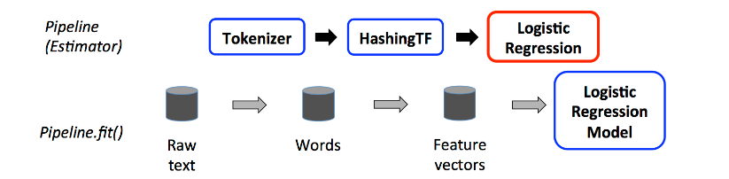

Above, the top row represents a Pipeline with three stages. The first two (Tokenizer and HashingTF) are Transformers 
(blue), and the third (LogisticRegression) is an Estimator (red). The bottom row represents data flowing through the 
pipeline, where cylinders indicate DataFrames. The Pipeline.fit() method is called on the original DataFrame, which has
raw text documents and labels. The Tokenizer.transform() method splits the raw text documents into words, adding a new 
column with words to the DataFrame. The HashingTF.transform() method converts the words column into feature vectors, 
adding a new column with those vectors to the DataFrame. Now, since LogisticRegression is an Estimator, the Pipeline 
first calls LogisticRegression.fit() to produce a LogisticRegressionModel. If the Pipeline had more Estimators, it 
would call the LogisticRegressionModel’s transform() method on the DataFrame before passing the DataFrame to the next
 stage.

A Pipeline is an Estimator. Thus, after a Pipeline’s fit() method runs, it produces a PipelineModel, which is a 
Transformer. This PipelineModel is used at test time; the figure below illustrates this usage.

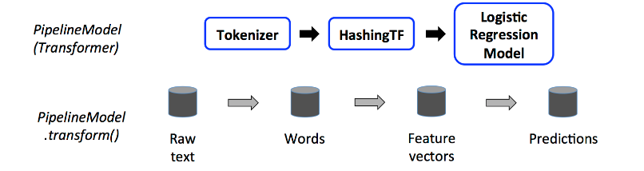

In the figure above, the PipelineModel has the same number of stages as the original Pipeline, but all Estimators in the
 original Pipeline have become Transformers. When the PipelineModel’s transform() method is called on a test dataset, 
the data are passed through the fitted pipeline in order. Each stage’s transform() method updates the dataset and passes
 it to the next stage.

Pipelines and PipelineModels help to ensure that training and test data go through identical feature processing steps.

###### Details
- DAG Pipelines: A Pipeline’s stages are specified as an ordered array. The examples given here are all for linear 
Pipelines, i.e., Pipelines in which each stage uses data produced by the previous stage. It is possible to create 
non-linear Pipelines as long as the data flow graph forms a Directed Acyclic Graph (DAG). This graph is currently 
specified implicitly based on the input and output column names of each stage (generally specified as parameters). If 
the Pipeline forms a DAG, then the stages must be specified in topological order.

- Runtime checking: Since Pipelines can operate on DataFrames with varied types, they cannot use compile-time type 
checking. Pipelines and PipelineModels instead do runtime checking before actually running the Pipeline. This type 
checking is done using the DataFrame schema, a description of the data types of columns in the DataFrame.

- Unique Pipeline stages: A Pipeline’s stages should be unique instances. E.g., the same instance myHashingTF should not
 be inserted into the Pipeline twice since Pipeline stages must have unique IDs. However, different instances 
 myHashingTF1 and myHashingTF2 (both of type HashingTF) can be put into the same Pipeline since different instances 
 will be created with different IDs.

###### Parameters
MLlib Estimators and Transformers use a uniform API for specifying parameters.

A Param is a named parameter with self-contained documentation. A ParamMap is a set of (parameter, value) pairs.

There are two main ways to pass parameters to an algorithm:

- Set parameters for an instance. E.g., if lr is an instance of LogisticRegression, one could call lr.setMaxIter(10) to 
make lr.fit() use at most 10 iterations. This API resembles the API used in spark.mllib package.
- Pass a ParamMap to fit() or transform(). Any parameters in the ParamMap will override parameters previously specified 
via setter methods.
Parameters belong to specific instances of Estimators and Transformers. For example, if we have two LogisticRegression 
instances lr1 and lr2, then we can build a ParamMap with both maxIter parameters specified: ParamMap(lr1.maxIter -> 10, 
lr2.maxIter -> 20). This is useful if there are two algorithms with the maxIter parameter in a Pipeline.

Note: Following topics are covered in Machine learning module. This are more ML generic in nature.  
- Extracting, transforming and selecting features
- Classification and Regression
- Collaborative filtering
- Frequent pattern mining
- Model selection and tuning  
