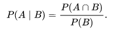

## Probability and Statistics Project

In this module we will explore the probability and statistics that is prerequisite for Data Science. We are going to focus on the following topics:

- Probability 
    - Introduction
        - Terminology of Probability
        - Types of events in probability
    - Random Variables
        - Types of random variables
    - Distribution of Random variables
        - Probability mass function
        - Cumulative Distribution Function
        - Probability Density functions
    - Expectation and variance for discrete random quantities 
    - The Bernoulli Distribution
    - The Binomial Distribution
    - The Poisson distribution
    - The Normal distribution     
    
- Statistics

### Probability

#### Introduction
Probability is the branch of mathematics concerning numerical descriptions of how likely an event is to occur, or how 
likely it is that a proposition is true. The probability of an event is a number between 0 and 1, where, roughly 
speaking, 0 indicates impossibility of the event and 1 indicates certainty. The higher the probability of an event, 
the more likely it is that the event will occur. A simple example is the tossing of a fair (unbiased) coin. Since the 
coin is fair, the two outcomes ("heads" and "tails") are both equally probable; the probability of "heads" equals the 
probability of "tails"; and since no other outcomes are possible, the probability of either "heads" or "tails" is 1/2 
(which could also be written as 0.5 or 50%).

##### Terminology of probability:

-   Experiment: An operation which can produce some well-defined outcomes, is called an Experiment.

    Example: When we toss a coin, we know that either head or tail shows up. So, the operation of tossing a coin may be 
    said to have two well-defined outcomes, namely, (a) heads showing up; and (b) tails showing up.

-   Random Experiment: When we roll a die we are well aware of the fact that any of the numerals 1,2,3,4,5, or 6 may 
    appear on the upper face but we cannot say that which exact number will show up. Such an experiment in which all 
    possible outcomes are known and the exact outcome cannot be predicted in advance, is called a Random Experiment.

-   Sample Space: All the possible outcomes of an experiment as an whole, form the Sample Space.

    Example: When we roll a die we can get any outcome from 1 to 6. All the possible numbers which can appear on the 
    upper face form the Sample Space(denoted by S). Hence, the Sample Space of a dice roll is S={1,2,3,4,5,6}

-   Outcome: Any possible result out of the Sample Space S for a Random Experiment is called an Outcome.

    Example: When we roll a die, we might obtain 3 or when we toss a coin, we might obtain heads.

-   Event: Any subset of the Sample Space S is called an Event (denoted by E). When an outcome which belongs to the 
    subset E takes place, it is said that an Event has occurred. Whereas, when an outcome which does not belong to 
    subset E takes place, the Event has not occurred.

    Example: Consider the experiment of throwing a die. Over here the Sample Space S={1,2,3,4,5,6}. Let E denote the 
    event of 'a number appearing less than 4.' Thus the Event E={1,2,3}. If the number 1 appears, we say that Event E 
    has occurred. Similarly, if the outcomes are 2 or 3, we can say Event E has occurred since these outcomes belong to 
    subset E.

-   Trial: By a trial, we mean performing a random experiment.

    Example: (i) Tossing a fair coin, (ii) rolling an unbiased die
    
##### Types of events in probability
-   Independent events: If two events, A and B are independent then the joint probability is 
     
     
    
    For example, if two coins are flipped, then the chance of both being heads is 1/2 x 1/2 = 1/4.

-   Mutually exclusive events: If either event A or event B can occur but never both simultaneously, then they are 
    called mutually exclusive events.

    If two events are mutually exclusive, then the probability of both occurring is denoted as 
    
     
    
    If two events are mutually exclusive, then the probability of either occurring is denoted as 
    
     

    For example, the chance of rolling a 1 or 2 on a six-sided die is P(1) + P(2) = 1/6 + 1/6 = 1/3

-   Not mutually exclusive events: If the events are not mutually exclusive then
    
     

    For example, when drawing a single card at random from a regular deck of cards, the chance of getting a heart or a 
    face card (J,Q,K) (or one that is both) is 13/52 + 12/52 - 3/52 = 11/26, since among the 52 cards of a deck, 13 are 
    hearts, 12 are face cards, and 3 are both: here the possibilities included in the "3 that are both" are included in 
    each of the "13 hearts" and the "12 face cards", but should only be counted once.

-   Conditional probability: Conditional probability is the probability of some event A, given the occurrence of some 
    other event B. Conditional probability is written P(A|B), and is read "the probability of A, given B". It is defined
    by
    
     
    
    If P(B)=0 then P(A|B) is formally undefined by this expression. In this case P(A) and P(B) are independent, since
    
     
        
    However, it is possible to define a conditional probability for some zero-probability events using a σ-algebra of 
    such events (such as those arising from a continuous random variable).

    For example, in a bag of 2 red balls and 2 blue balls (4 balls in total), the probability of taking a red ball is 
    1/2; however, when taking a second ball, the probability of it being either a red ball or a blue ball depends on the
     ball previously taken. For example, if a red ball was taken, then the probability of picking a red ball again would
    be 1/3, since only 1 red and 2 blue balls would have been remaining. And if a blue ball was taken previously, the 
    probability of taking a red ball will be 2/3.

-   Inverse probability: In probability theory and applications, Bayes' rule relates the odds of event A1 to 
    event A2, before (prior to) and after (posterior to) conditioning on another event B. The odds on 
    A1 to event A2 is simply the ratio of the probabilities of the two events. When arbitrarily 
    many events A are of interest, not just two, the rule can be rephrased as posterior is proportional to prior times 
    likelihood, P(A|B) ∝ P(A)P(B|A) where the proportionality symbol means that the left hand side is proportional to
    (i.e., equals a constant times) the right hand side as A varies, for fixed or given B.
    
#### Random variables

A random variable is a variable whose value is a numerical outcome of a random phenomenon. Random variable is also 
referred as random quantity, aleatory variable, or stochastic variable.   

Example: Suppose  two  coins  are  tossed  simultaneously  then  the  sample  space  is S= {HH, HT, TH, TT}. Let X 
denote the number of heads, then if X = 0 then the outcome is {TT} and P(X = 0) = 1/4. If  X takes the value  1,  then 
outcome is {HT,  TH}  and  P(X = 1) = 2/4.  Next if X takes  the value  2  then  the outcome  is  {HH}  and  
P(X  =  2) = 1/4. 

The probability distribution for a random variable describes how the probabilities are distributed over the values of 
the random variable.

The  probability  distribution  of  above random variable X is given by the following table:

 

A Discrete Variable is a variable whose value is obtained by counting. 
Ex:  Number of students present, number of red marbles in jars.

A continuous Variable is a variable whose value is obtained by measuring.
Ex:  height of student, time taken to travel a distance x.
    
###### Types of Random Variables: 

There are two types of random variables:
-  Discrete random variables: A discrete random variable takes a finite number of possible outcome. example: Throw of 
   dice, Number of defective bulbs in a batch.
   
-  Continuous random variables: A continous random variable takes all values in an interval. example: height, weight of 
   persons.

##### Distribution of Random variables:

A Distribution function is mathematical expression that describes the probability that a system takes on a specific 
value or set of values.

The probability distribution for a random variable describes how the probabilities are distributed over the values of 
the random variable. 

##### Probability mass functions
 
For a discrete random variable, x, the probability distribution is defined by a probability mass 
function, denoted by f(x). This function provides the probability for each value of the random variable. In the 
development of the probability function for a discrete random variable, two conditions must be satisfied: (1) f(x) must 
be non-negative for each value of the random variable, and (2) the sum of the probabilities for each value of the random
variable must equal one.

Example
For the example above concerning the sum of two dice, the probability distribution is
{(2,1/36),(3,2/36),(4,3/36),(5,4/36),(6,5/36),(7,6/36), (8,5/36),(9,4/36),(10,3/36),(11,2/36),(12,1/36)}
and the probability mass function can be tabulated as

 

##### Cumulative Distribution Function

The PMF is one way to describe the distribution of a discrete random variable. As we will see later on, PMF cannot be 
defined for continuous random variables. The cumulative distribution function (CDF) of a random variable is another 
method to describe the distribution of random variables. The advantage of the CDF is that it can be defined for any kind
 of random variable (discrete, continuous, and mixed).

The cumulative distribution function (CDF) of random variable X is defined as 
Fx(x)=P(X≤x), for all x∈R.

Note that the subscript X indicates that this is the CDF of the random variable X. Also, note that the CDF is defined 
for all x∈R. Let us look at an example.

Example:
I toss a coin twice. Let X be the number of observed heads. Find the CDF of X.

The range of X is RX={0,1,2} and its PMF is given by

PX(0)=P(X=0)=14,

PX(1)=P(X=1)=12,

PX(2)=P(X=2)=14.

To find the CDF, we argue as follows. First, note that if x<0, then

FX(x)=P(X≤x)=0, for x<0.

Next, if x≥2,

FX(x)=P(X≤x)=1, for x≥2.

Next, if 0≤x<1,

FX(x)=P(X≤x)=P(X=0)=14, for 0≤x<1.

Finally, if 1≤x<2,

FX(x)=P(X≤x)=P(X=0)+P(X=1)=14+12=34, for 1≤x<2.

Thus, to summarize, we have

 

Note that when you are asked to find the CDF of a random variable, you need to find the function for the entire real 
line. Also, for discrete random variables, we must be careful when to use "<" or "≤". Figure 3.3 shows the graph of 
FX(x). Note that the CDF is flat between the points in RX and jumps at each value in the range. The size of the jump at 
each point is equal to the probability at that point. For, example, at point x=1, the CDF jumps from 14 to 34. The size 
of the jump here is 34−14=12 which is equal to PX(1). Also, note that the open and closed circles at point x=1 indicate 
that FX(1)=34 and not 14.

 

##### Probability Density functions

A continuous random variable may assume any value in an interval on the real number line or in a collection of intervals.
Since there is an infinite number of values in any interval, it is not meaningful to talk about the probability that the
 random variable will take on a specific value; instead, the probability that a continuous random variable will lie 
 within a given interval is considered.
 
In the continuous case, the counterpart of the probability mass function is the probability density function, also 
denoted by f(x). For a continuous random variable, the probability density function provides the height or value of the 
function at any particular value of x; it does not directly give the probability of the random variable taking on a 
specific value. However, the area under the graph of f(x) corresponding to some interval, obtained by computing the 
integral of f(x) over that interval, provides the probability that the variable will take on a value within that 
interval. A probability density function must satisfy two requirements: (1) f(x) must be non-negative for each value of 
the random variable, and (2) the integral over all values of the random variable must equal one.

Example
Let’s say that we have a random variable x that can take values between 0 and 1. Here is its probability density 
function:

We can see that 0 seems to be not possible (probability around 0) and neither 1. The pic around 0.3 means that will get 
a lot of outcomes around this value.

Finding probabilities from probability density function between a certain range of values can be done by calculating the
 area under the curve for this range. For example, the probability of drawing a value between 0.5 and 0.6 corresponds to
the following area:

 

##### Expectation and variance for discrete random quantities

Expectation:

Let X be a random variable with possible outcomes x1, x2, ..., xn with probabilities 
p1, p2, ..., pn then, Mathematical expectation or expected value of X is defined as 
"Sum of products of different values of x and their corresponding probabilities" denoted by E(x) or μ. 

 

E(X) is the expectation value of the continuous random variable X, x is the value of the continuous random variable 
P(x) is the probability mass function of X

Properties of expectation:
- Linearity: When a is constant and X,Y are random variables:
   
   E(aX) = aE(X)
   
   E(X+Y) = E(X) + E(Y)

- Constant: When c is constant:

   E(c) = c

- Product: When X and Y are independent random variables:

E(X ⋅Y) = E(X) ⋅ E(Y)

Example
For the sum of two dice, X, we have
E(X) = 2×1/36 + 3×2/36 +4×3/36+···+12×1/36= 7.

By looking at the symmetry of the mass function, it is clear that in some sense 7 is the “central”
value of the probability distribution.

Variance:
We now have a method for summarising the location of a given probability distribution, but we
also need a summary for the spread. For a discrete random quantity X, the variance of X is defined by

 

The variance is often denoted σ 2  X, or even just σ2. Again, this is a known function 
of the probability distribution. It is not random, and it is not the sample variance of a set of data. Again, the two 
are related in a way to be made precise later. The variance can be re-written as 

 

and this expression is usually a bit easier to work with. We also define the standard deviation of a
random quantity by

 

and this is usually denoted by σX or just σ.

Example
For the sum of two dice, X, we have

Properties of variance: 

Variance of an independent sum: If X and Y are independent random quantities, then
Var(X +Y) = Var(X) +Var(Y). 

#### The Bernoulli Distribution

A random variable whose outcome have been classified into two categories, called “success” and “failure”, represented by
 the letters s and f, respectively, is called a Bernoulli trial. If a random variable X is defined as 1 if a Bernoulli 
trial results in success and 0 if the same Bernoulli trial results in failure, then X has a Bernoulli distribution with 
parameter p = P[success]. The definition of this distribution is: A random variable X has a Bernoulli distribution if 
the discrete density of X is given by:

where p = P[X = 1]. For the above defined random variable X we have that:

#### The Binomial Distribution

Two of the most widely used discrete probability distributions are the binomial and Poisson. The binomial probability 
mass function provides the probability that x successes will occur in n trials of a binomial experiment.

A binomial experiment has four properties:
 - It consists of a sequence of n identical trials
 - Two outcomes, success or failure, are possible on each trial 
 - The probability of success on any trial, denoted p, does not change from trial to trial
 - The trials are independent. 
 
Example: A certain kind of lizard lays 8 eggs, each of which will hatch independently with probability
0.7. Let Y denote the number of eggs which hatch. Then Y ∼ B(8,0.7)

For the lizard eggs, Y ∼ B(8,0.7) we have

We can therefore tabulate and plot the probability mass function and cumulative distribution function as follows.

Expectation of Binomial distribution = np
Variance of Binomial distribution = np(1-p)
Where n is the number of trials, p is the probability of event occurrence and 1-p is the probability of not occurring. 

#### The Poisson distribution

The Poisson probability distribution is often used as a model of the number of arrivals at a facility within a given 
period of time. The Poisson distribution is a very important discrete probability distribution, which arises in many
different contexts in probability and statistics. Typically, Poisson random quantities are used in place of binomial 
random quantities in situations where n is large, p is small, and the expectation np is stable

A random variable X has a Poisson distribution, X ∼ Poisson(λ), if the discrete density of X is given by:

Expectation of poisson distribution and variance is given by

Example: It is known that the average number of daily changes in excess of 1%, for a specific stock Index, occurring in 
each six-month period is 5. What is the probability of having one such a change within the next 6 months? What is the 
probability of at least 3 changes within the same period? We model the number of in excess of 1% changes, X, within the 
next 6 months as a Poisson process. We know that E[X] = λ = 5. Hence 

for x = 0, 1, 2, , ... Then 

P[X = 1] = fX(1) = e−551/1! = 0.0337. 

Also P[X ≥ 3] = 1 − P[X < 3] =

We can approximate the Binomial with Poisson. The approximation is better the smaller the p and the larger the n.

#### The Normal distribution  