## Statistics

In this section we will mostly deal with statistics. We will start with some basics and then move on to the advanced topics like hypothesis analysis. They are given in the subsections below:

### Statistics Basics

Our life is full of events and phenomena that enhance us to study either natural or artificial phenomena could be studied using different fields and one of them is statistics. We do find the applications of statistics are many and varied forms like while reading newspapers /  magazines or while listening to the radio, or watching television.

Since statistics is used in almost every field of  endeavor, statistics plays an important role in affecting our lives. Statistics is divided into two main areas, which are descriptive and inferential statistics. They are explained in the following subsections.

##### Descriptive Statistics

Suppose that a test in statistics course is given to a class and the test scores for all students are collected, then the test scores for the students are called data set. Usually the data set is very large in the original form and it is not easy to use it to draw a conclusions or to make decisions while it is very easy to draw conclusions from summary tables and diagrams than from such original data. So reducing the data set to form more control by constructing tables, drawing graphs and provide some numerical characteristics for which is a simple definition to introduce descriptive statistics.

##### Inferential Statistics

The set of all elements (observations) of interest in a study is called a population, and the selected numbers of  elements from the population is called a sample. In statistical problems, we may be interested to make a decision and prediction about a population by using results that obtained from selected samples, for instance we may be interested to find the number of absent students on a certain day of a week. To do so, we may select 200 classes and register the number of students that are absent on that day, then we can use this information to make a decision. The area of statistics that interest on such decision is referred to inferential statistics.

##### Numerical summaries

A numerical summary is a number used to describe a specific characteristic about a data set. There are many ways to numerically summarize data. The fundamental idea is to describe the center, or most probable values of the data, as well as the spread, or the possible values of the data. The ways to measure them are given below:

*Mean*
The sample mean, or average, of a group of values is calculated by taking the sum of all of the values and dividing by the total number of values. In other words, for n values x1, x2, x3, ... , xn, the mean = (x1 + x2 + x3 + ... + xn)/n

*Median*
The median of a group of values is the center, or midpoint, of the ordered values. The median is calculated by placing a group of values in ascending order and taking the center observation of the ordered list, such that there are an equal number of values above and below the median (for an even number of observations, one may take the average of the two center values).

*Quartiles*
The first quartile of a group of values is the value such the 25% of the values fall at or below this value. The third quartile of a group of values is the value such that 75% of the values fall at or below this value. The first quartile may be approximately calculated by placing a group of values in ascending order and determining the median of the values below the true median, and the third quartile is approximately calculated by determining the median of the values above the true median. For an odd number of observations, the median is excluded from the calculation of the first and third quartiles. The distance between the first and third quartiles is known as the Inter-Quartile Range (IQR).

*Variance and Standard Deviation*
The variance of a group of values measures the spread of the distribution. A large variance indicates a wide range of values, while a small variance indicates that the values lie close to their mean. The variance s² is calculated by summing the squared distances from each value to the mean of the values, then dividing by one fewer than the number of observations. The standard deviation s is the square root of the variance. The formula for variance is given as:

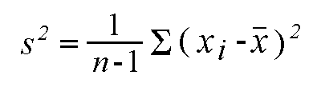

### Central Tendency

Central tendency is a descriptive summary of a dataset through a single value that reflects the center of the data distribution. Along with the variability (dispersion) of a dataset, central tendency is a branch of descriptive statistics. It can only delivers a comprehensive summary of the whole dataset. There are measures of central tendency. They are given below:

- Mean (Average): Represents the sum of all values in a dataset divided by the total number of the values.
- Median: The middle value in a dataset that is arranged in ascending order (from the smallest value to the largest value). If a dataset contains an even number of values, the median of the dataset is the mean of the two middle values.
- Mode: Defines the most frequently occurring value in a dataset. In some cases, a dataset may contain multiple modes, while some datasets may not have any mode at all.

##### Skewness

The preferred measure of central tendency often depends on the shape of the distribution. Of the three measures of tendency, the mean is most heavily influenced by any outliers or skewness. In a symmetrical distribution, the mean, median, and mode are all equal. In these cases, the mean is often the preferred measure of central tendency.

Skewness refers to a distortion or asymmetry that deviates from the symmetrical bell curve, or normal distribution, in a set of data. If the curve is shifted to the left or to the right, it is said to be skewed. Skewness can be quantified as a representation of the extent to which a given distribution varies from a normal distribution. All three types of skewness are illustrated below:

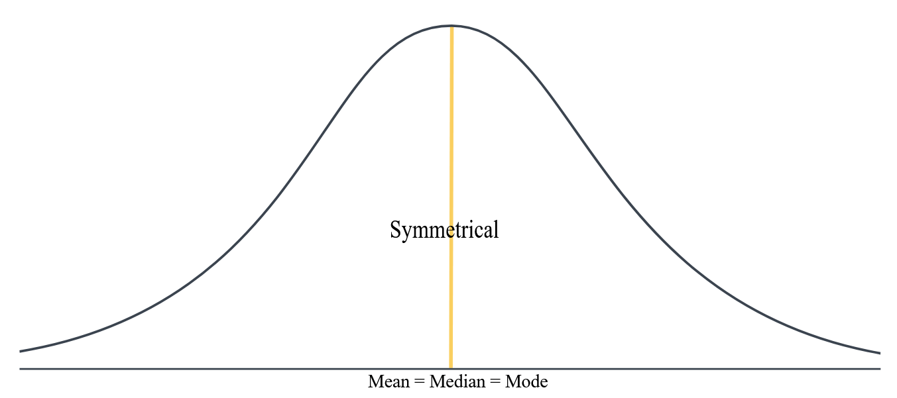

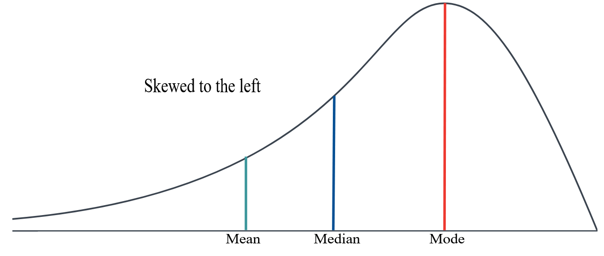

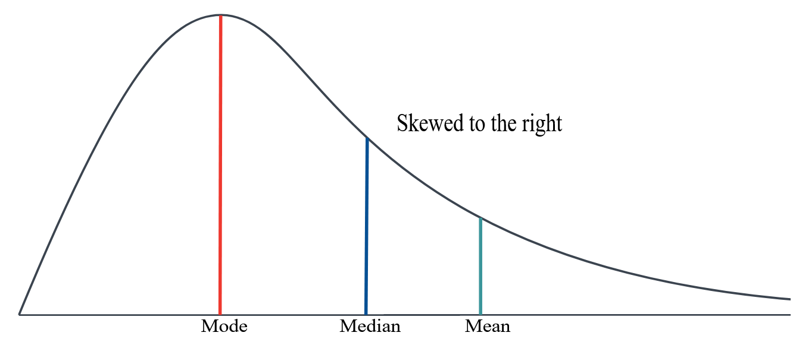

Measurement of skewness is also important. There are several ways to measure skewness. Pearson’s first and second coefficients of skewness are two common ones. Pearson’s first coefficient of skewness, or Pearson mode skewness, subtracts the mode from the mean and divides the difference by the standard deviation. Pearson’s second coefficient of skewness, or Pearson median skewness, subtracts the median from the mean, multiplies the difference by three, and divides the product by the standard deviation. They are illustrated as:

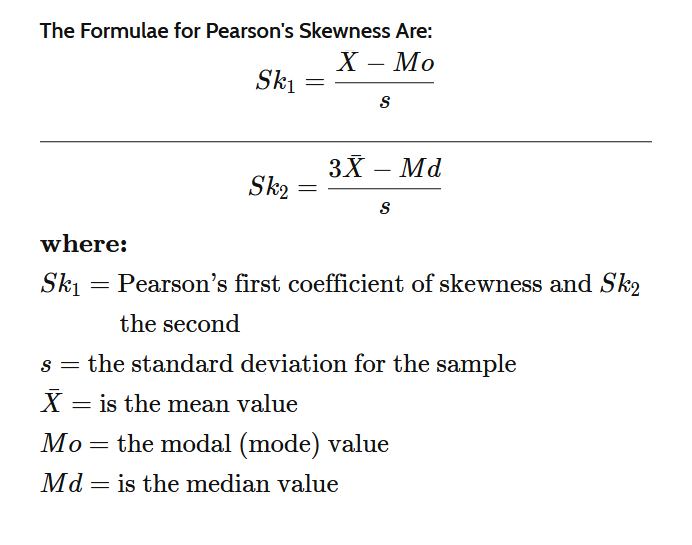

The interpretation of skewness measure can be given as:

- If skew = 0, then the data is not skewed
- If skew > 0, then the data is left skewed and if skew > 1 then the data is highly left skewed
- If skew < 0, then the data is right skewed and if skew < -1 then the data is highly right skewed

##### Kurtosis

Kurtosis is a statistical measure that defines how heavily the tails of a distribution differ from the tails of a normal distribution. In other words, kurtosis identifies whether the tails of a given distribution contain extreme values. A large kurtosis is associated high variability with a extremely large and extremely small values. On the other hand, a small kurtosis signals a moderate variability because the probabilities of extreme values are relatively low. The types of kurtosis are determined by the excess kurtosis of a particular distribution. The excess kurtosis can take positive or negative values, as well as values close to zero. They are given as

- Mesokurtic: Data that follows a mesokurtic distribution shows an excess kurtosis of zero or close to zero. This means that if the data follows a normal distribution, it follows a mesokurtic distribution.
- Leptokurtic: Leptokurtic indicates a positive excess kurtosis. The leptokurtic distribution shows heavy tails on either side, indicating large outliers.
-  Platykurtic: A platykurtic distribution shows a negative excess kurtosis. The kurtosis reveals a distribution with flat tails. The flat tails indicate the small outliers in a distribution.

### Relationship with variables

When we consider relationships among variables we take into account, we generally consider that there is atleast a predictor X and a response Y. This relationship can take on different forms, of course, like a line or a curve, but there’s really only one relationship here to measure. In this we measure how the data is spread out and relation among variables that are present in the dataset with various measures. They are given in the following subsections.

##### Covariance

In statistics, we have been interested in understanding the relationship between one or more explanatory variables (also called independent variable or a predictor variable) and a response variable (also called dependent variable or an outcome variable). However, occasionally there may be other variables that can affect the response variable that are not of interest. These variables are known as covariates.

For example, suppose researchers want to know if three different studying techniques lead to different average exam scores at a certain school. The studying technique is the explanatory variable and the exam score is the response variable. However, there’s bound to exist some variation in the student’s studying abilities within the three groups. If this isn’t accounted for, it will be unexplained variation within the study and will make it harder to actually see the true relationship between studying technique and exam score. One way to account for this could be to use the student’s current grade in the class as a covariate. It’s well known that the student’s current grade is likely correlated with their future exam scores. Thus, although current grade is not a variable of interest in this study, it can be included as a covariate so that researchers can see if studying technique affects exam scores even after accounting for the student’s current grade in the class.

In statistics, we are also interested in a measure of relationship between two variables. Keeping covariates aside we want to evaluate to what extent that those variables has a chance together. This measure is given by covariance. It is essentially a measure of the variance between two variables. However, the metric does not assess the dependency between variables.

Covariance is measured in units. The units are computed by multiplying the units of the two variables. The variance can take any positive or negative values. The values are interpreted as follows:

- Positive covariance: Indicates that two variables tend to move in the same direction.
- Negative covariance: Reveals that two variables tend to move in inverse directions.

The covariance formula deals with the calculation of data points from the average value in a dataset. For example, the covariance between two random variables X and Y can be calculated using the following formula (for population):

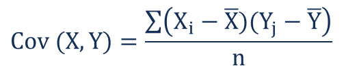

For sample covariance, the formula looks like:

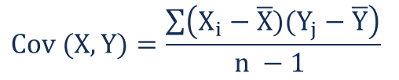

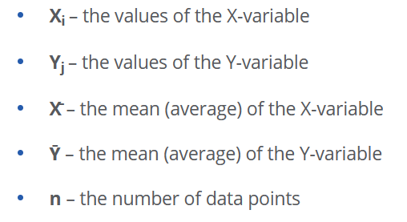

##### Analysis of Variance (ANOVA)

Analysis of variance (ANOVA) is an analysis tool used in statistics that splits an observed aggregate variability found inside a data set into two parts: systematic factors and random factors. The systematic factors have a statistical influence on the given data set, while the random factors do not. Analysts use the ANOVA test to determine the influence that independent variables have on the dependent variable in a regression study. The ANOVA coefficient can be calculated as:

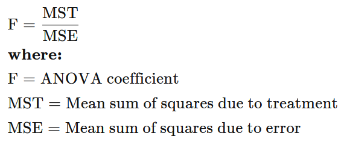

The ANOVA test is the initial step in analyzing factors that affect a given data set. Once the test is finished, an analyst performs additional testing on the methodical factors that measurably contribute to the data set's inconsistency. The analyst utilizes the ANOVA test results in an f-test to generate additional data that aligns with the proposed regression models. The ANOVA test allows a comparison of more than two groups at the same time to determine whether a relationship exists between them. The result of the ANOVA formula, the F statistic (also called the F-ratio), allows for the analysis of multiple groups of data to determine the variability between samples and within samples. If no real difference exists between the tested groups, which is called the null hypothesis, the result of the ANOVA's F-ratio statistic will be close to 1. The distribution of all possible values of the F statistic is the F-distribution. This is actually a group of distribution functions, with two characteristic numbers, called the numerator degrees of freedom and the denominator degrees of freedom.

There are two main types of ANOVA: one-way (or unidirectional) and two-way. There also variations of ANOVA. For example, MANOVA (multivariate ANOVA) differs from ANOVA as the former tests for multiple dependent variables simultaneously while the latter assesses only one dependent variable at a time. One-way or two-way refers to the number of independent variables in your analysis of variance test. A one-way ANOVA evaluates the impact of a sole factor on a sole response variable. It determines whether all the samples are the same. The one-way ANOVA is used to determine whether there are any statistically significant differences between the means of three or more independent (unrelated) groups. A two-way ANOVA is an extension of the one-way ANOVA. With a one-way, you have one independent variable affecting a dependent variable. With a two-way ANOVA, there are two independents. For example, a two-way ANOVA allows a company to compare worker productivity based on two independent variables, such as salary and skill set. It is utilized to observe the interaction between the two factors and tests the effect of two factors at the same time.

##### Correlation

Correlation is a statistical measure that expresses the extent to which two variables are linearly related (meaning they change together at a constant rate). It’s a common tool for describing simple relationships without making a statement about cause and effect. Correlations are useful for describing simple relationships among data. For example, imagine that you are looking at a dataset of campsites in a mountain park. You want to know whether there is a relationship between the elevation of the campsite (how high up the mountain it is), and the average high temperature in the summer. For each individual campsite, you have two measures: elevation and temperature. When you compare these two variables across your sample with a correlation, you can find a linear relationship: as elevation increases, the temperature drops. They are negatively correlated.

We describe correlations with a unit-free measure called the correlation coefficient which ranges from -1 to +1 and is denoted by r. Statistical significance is indicated with a p-value. A p-value is a measure of probability used for hypothesis testing. Therefore, correlations are typically written with two key numbers: r = and p = . It has the following implications:

- The closer r is to zero, the weaker the linear relationship.
- Positive r values indicate a positive correlation, where the values of both variables tend to increase together.
- Negative r values indicate a negative correlation, where the values of one variable tend to increase when the values of the other variable decrease.
- The p-value gives us evidence that we can meaningfully conclude that the population correlation coefficient is likely different from zero, based on what we observe from the sample.
- "Unit-free measure" means that correlations exist on their own scale: in our example, the number given for r is not on the same scale as either elevation or temperature. This is different from other summary statistics. For instance, the mean of the elevation measurements is on the same scale as its variable.

The most common formula to calculate correlation coefficient is the Pearson Correlation coefficient used for linear dependency between the data sets. The value of the coefficient lies between -1 to +1. When the coefficient comes down to zero, then the data is considered as not related. While, if we get the value of +1, then the data are positively correlated, and -1 has a negative correlation. The formula looks like:

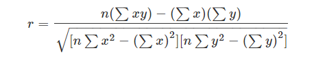

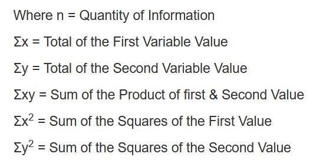

Correlation coefficient can also be calculated using: linear correlation coefficient, sample correlation coefficient and population correlation coefficient.

##### Spurious Relationship

“Spurious relationships” are relationships in which two or more variables seem to be related (correlated) but are not in fact directly linked. The two independent variables may, however, be found to have a connection mainly as a coincidence or due to the existence of unforeseen factors. Relationship is caused by third “lurking” variable. and could influence independent variable, or both independent and dependent variables.

Let's look into an example where a researcher notices a relationship between speeding and traffic accidents. So, they ask the question: does speed kill? It could be due to:

- Dependent variable: Reported accidents
- Independent variable: Speeding violations
- Hypothesis: Individuals with higher numbers of speeding violations will get in more accidents.
- Data: Driving records of 100 serious driving accidents
- Finds support for the hypothesis

So now what is wrong here?

- First, the data is selected on the dependent variable. This is not good. The dependent variable does not vary.
- Spurious relationship: what if there is a third variable that has a greater influence on the dependent variable

So, another researcher takes a random sample of drivers (both in accidents and not). He includes an additional variable: miles driven. It seems to look like that from his findings that the more miles one drives the more likely they are to get tickets and the more likely they are to get into accidents. This looks like that miles driven is a third wheel in the relationship between speeding violations and reported accidents. This is a spurious relationship and can be demonstrated by the following diagram.

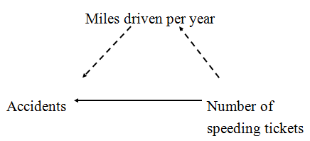

##### Chi-Squared Test of Independence

The chi-square test of independence is used to test for a relationship between two categorical variables. Recall that if two categorical variables are independent, then P(A) = P(A|B). The chi-square test of independence uses this fact to compute expected values for the cells in a two-way contingency table under the assumption that the two variables are independent (i.e., the null hypothesis is true).

The Chi-square test is a non-parametric statistic, also called a distribution free test. Non-parametric tests should be used when any one of the following conditions pertains to the data:

- The level of measurement of all the variables is nominal or ordinal.
- The sample sizes of the study groups are unequal; for the χ2 the groups may be of equal size or unequal size whereas some parametric tests require groups of equal or approximately equal size.
- The original data were measured at an interval or ratio level, but violate one of the following assumptions of a parametric test:
  - The distribution of the data was seriously skewed or kurtotic (parametric tests assume approximately normal distribution of the dependent variable), and thus the researcher must use a distribution free statistic rather than a parametric statistic.
  - The data violate the assumptions of equal variance or homoscedasticity.
  - For any of a number of reasons (1), the continuous data were collapsed into a small number of categories, and thus the data are no longer interval or ratio.

A Chi-Square test of independence uses the following null and alternative hypotheses:

- H(0): (null hypothesis) The two variables are independent.
- H(1): (alternative hypothesis) The two variables are not independent. (i.e. they are associated)

Considering all these, we can define the chi's square test as:

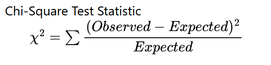

where the expected cell value can be given as:

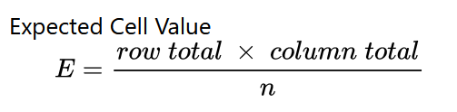

If the p-value that corresponds to the test statistic χ2 with (number of rows - 1)*(number of columns - 1) degrees of freedom is less than your chosen significance level then you can reject the null hypothesis.

##### Mediation

In statistics, a mediation model seeks to identify and explain the mechanism or process that underlies an observed relationship between an independent variable and a dependent variable via the inclusion of a third hypothetical variable, known as a mediator variable (also a mediating variable, intermediary variable, or intervening variable).[1] Rather than a direct causal relationship between the independent variable and the dependent variable, a mediation model proposes that the independent variable influences the (non-observable) mediator variable, which in turn influences the dependent variable. Thus, the mediator variable serves to clarify the nature of the relationship between the independent and dependent variables.[2]

Mediation analyses are employed to understand a known relationship by exploring the underlying mechanism or process by which one variable influences another variable through a mediator variable.[3] In particular, mediation analysis can contribute to better understanding the relationship between an independent variable and a dependent variable when these variables do not have an obvious direct connection.

Let's consider an example where we consider that a previous studies have suggested that higher grades predict higher happiness: X (grades) → Y (happiness). It can be shown be the following illustration:

However, grades are not the real reason that happiness increases. We can hypothesize that good grades boost one’s self-esteem and then high self-esteem boosts one’s happiness: X (grades) → M (self-esteem) → Y (happiness).

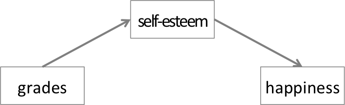

This is a typical case of mediation analysis. Self-esteem is a mediator that explains the underlying mechanism of the relationship between grades (IV) and happiness (DV).

##### Moderation

In statistics, moderation occurs when the relationship between two variables depends on a third variable. The third variable is referred to as the moderator variable or simply the moderator. The effect of a moderating variable is characterized statistically as an interaction; that is, a categorical (e.g., sex, ethnicity, class) or quantitative (e.g., level of reward) variable that affects the direction and/or strength of the relation between dependent and independent variables. Specifically within a correlational analysis framework, a moderator is a third variable that affects the zero-order correlation between two other variables, or the value of the slope of the dependent variable on the independent variable. In analysis of variance (ANOVA) terms, a basic moderator effect can be represented as an interaction between a focal independent variable and a factor that specifies the appropriate conditions for its operation.

To illustrate this, we start with a bivariate relationship between an input variable X and an outcome variable Y. For example, X could be the number of training sessions (training intensity) and Y could be math test score. We can hypothesize that there is a relationship between them such that the number of training sessions predicts math test performance. Using the diagram, we can portray the relationship below:

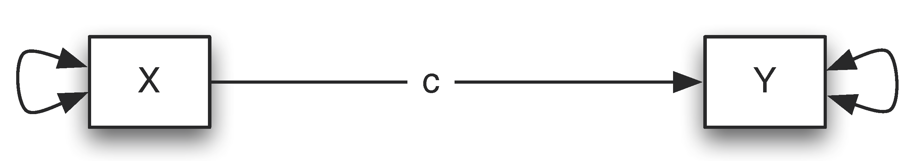

The above path diagram can be expressed using a regression model as

Y=β0+β1∗X+ϵ

where β0 is the intercept and β1 is the slope.

A moderator variable Z is a variable that alters the strength of the relationship between X
and Y. In other words, the effect of X on Y depends on the levels of the moderator Z. For instance, if male students (Z=0) benefit more (or less) from training than female students (Z=1), then gender can be considered as a moderator. Using the diagram, if the coefficient a is different b, there is a moderation effect.

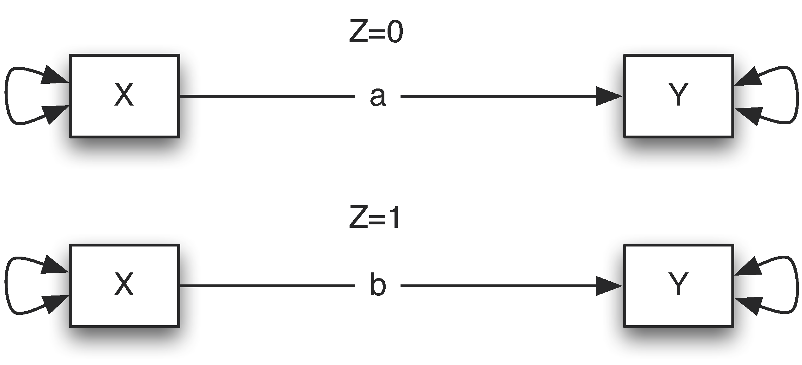

To summarize, a moderator Z is a variable that alters the direction and/or strength of the relation between a predictor X and an outcome Y. Questions involving moderators address “when” or “for whom” a variable most strongly predicts or causes an outcome variable. Using a path diagram, we can express the moderation effect as:

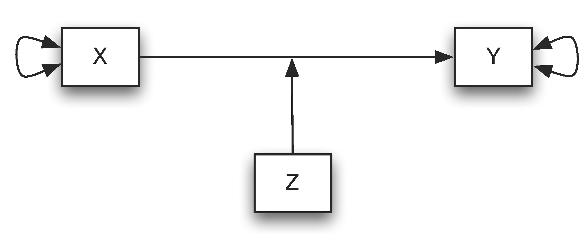

### Central Limit Theorem

In this section, we will mostly discuss about Central Limit Theorem and bit on normal distribution. We will start first with normal distribution. It is given in the section below:

##### Normal Distribution

A normal distribution is a continuous, symmetric, bell-shaped distribution of a variable. The theoretical shape of a normal distribution is given by the mathematical formula:

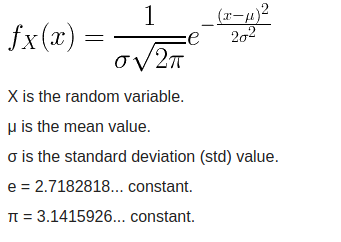

The shape of a normal distribution is fully characterized by its mean μ and standard deviation σ.

- μ specifies the location of the distribution.
- σ specifies the spread/shape of the distribution

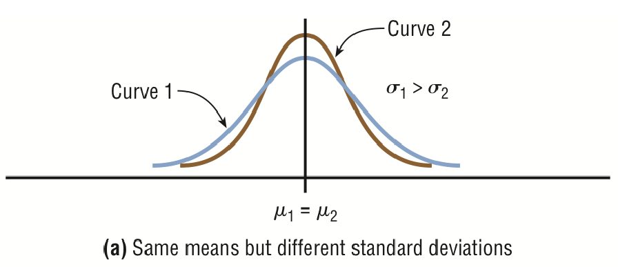

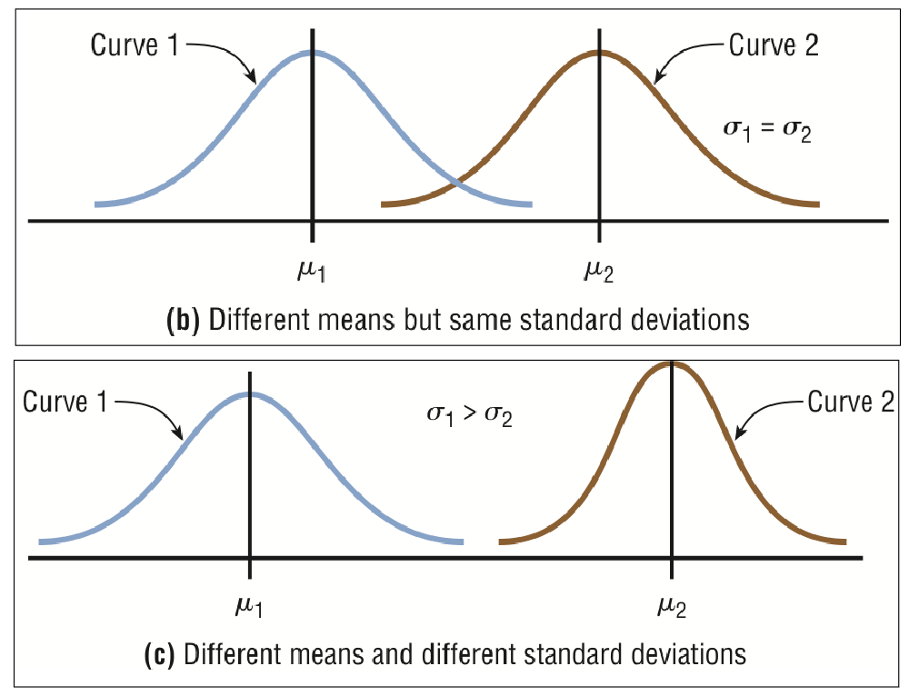

All normally distributed variables can be transformed into a standard normally distributed variable using the formula for the standard score (z-score):

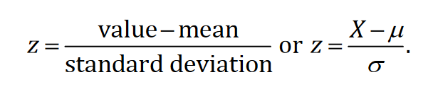

The z-score for an observation is the number of standard deviations the observation lies from the mean. The letter Z is used to denote a standard normal random variable.

##### Central Limit Theorem

If we took numerous random samples and calculated the sample means, what distribution would the sample means
have?  This distribution is known as the sampling distribution of the sample means.

*Sampling distribution of sample means* – The distribution of the sample means calculated from all possible random samples of size n from a population.

If the samples are randomly selected, the sample means will be somewhat different from the population mean μ. These differences are due to sampling error.

*Sampling error* - The difference between the sample measure and the corresponding population measure due to the fact that the sample is not a perfect representation of the population.

*Properties of the Distribution of Sample Means:*  

When all possible samples of a specific size are selected with replacement from a population, the distribution of the sample means for a variable has three important properties:  
- The mean of the sample means will be the same as the population mean and is given by

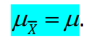

- The standard deviation of the sample means (known as the standard error of the mean) is given by

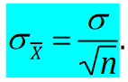

*Central Limit Theorem:*  The distribution of the sample mean gets closer and closer to a normal distribution as the sample size increases. This distribution has a mean  and a standard deviation 

Even when we don’t know the distribution of the population, if the sample size is sufficiently large, then we can use the properties of the normal distribution to make statistical inference about the population mean!  So essentially, if the sample size is large enough we can make statistical inference about the population mean even if we don’t know anything else about the population.

If the population size is really large, then the results about the sampling distribution of the mean are approximately correct even if sampling without replacement. When the sample size is sufficiently large (30+), the central limit theorem can be used to answer questions about sample means in the same way that a normal distribution can be used to answer questions about individual data.  However, our z-score formula changes slightly to

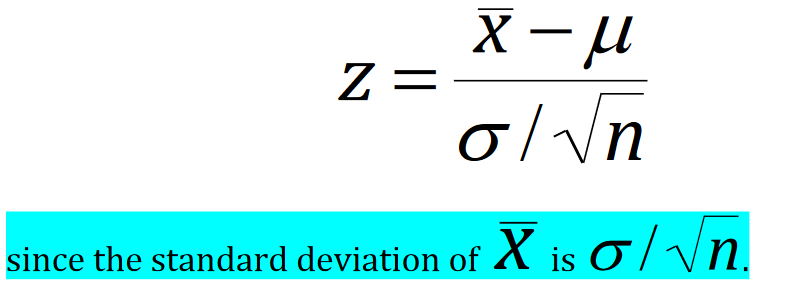

### Estimation
Statistical inference is the process by which we infer population properties from sample properties. We can do it either by estimations or by hypothesis testing. We will discuss hypothesis testing in the next section. In statistics, estimation refers to the process by which one makes inferences about a population (or parameters of a distribution), based on information obtained from a sample. There are two forms of estimation:

- Point estimation: A specific numerical value used as an estimation of a parameter
  - A point estimate uses a specific value to estimate a population parameter.
  - Example: The sample mean is often the best point estimate of the population mean μ since the means of samples often vary less than sample medians or modes
- Interval estimation: An interval or a range of values used to estimate an parameter
  - The interval may or may not contain the true value of the parameter (but we hope it does).
  - We can use statistical knowledge to assign a degree of confidence that our interval contains the true value of the population parameter.
  - An interval estimate uses an interval of likely values to estimate the value of the population parameter

They are illustrated as:

Point estimate:

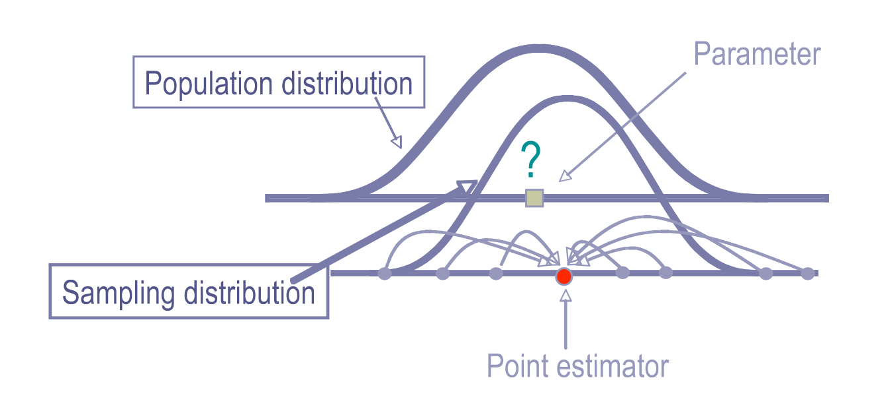

Interval estimate:

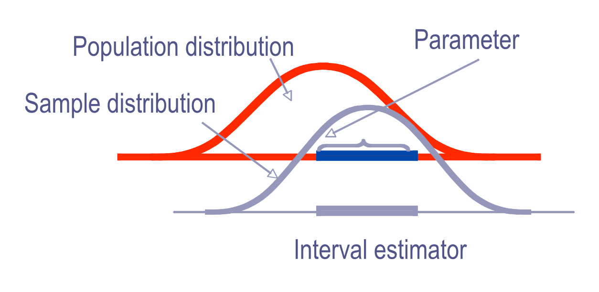

The desirability of an estimator is judged by its characteristics. Three important criteria are:

- The estimator should be an *unbiased estimator*.
  - The mean of the point estimates obtained from all samples of a given size is equal to the parameter being estimated.
- The estimator should be a *consistent estimator*.
  - As the sample size increases, the value of the estimator should approach the value of the parameter being estimated.
- The estimator should be *relatively efficient*.
  - The variance of the estimator should be the smallest of all comparable estimators.

*Confidence level* – The proportion of interval estimates that will contain the true value of the population parameter when we consider all possible samples of a fixed size n from the population. This number doesn’t refer to a specific interval, but to the proportion of intervals that will contain the population parameter.  We can actually choose this number and construct our  interval accordingly.  The number is typically chosen to
be close to 1, most commonly 0.95 or 95% .

*Confidence interval* – A specific interval estimate of a parameter determined by using data obtained from a sample and by using the specific confidence level of the estimate.

Now the question arises that how can we construct a confidence interval? Suppose we have a population with a normal distribution or we select samples with at least 30 observations.  What do we know about the distribution of the sample means? Let's Central Limit Theorem to estimate properties of the sample mean. We will use z-score to estimate the mean. The formula looks like:

Now, if we need estimate with 95% confidence that the interval we need to refer to the table where we know the z-score value when we are 95% confident. The table is given below:

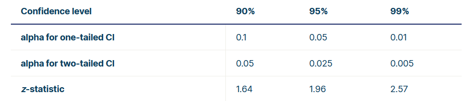

With reference to the table we can get that at 95% confidence the z-score would be 1.96. Now, we modify the z-score to estimate mean μ as:

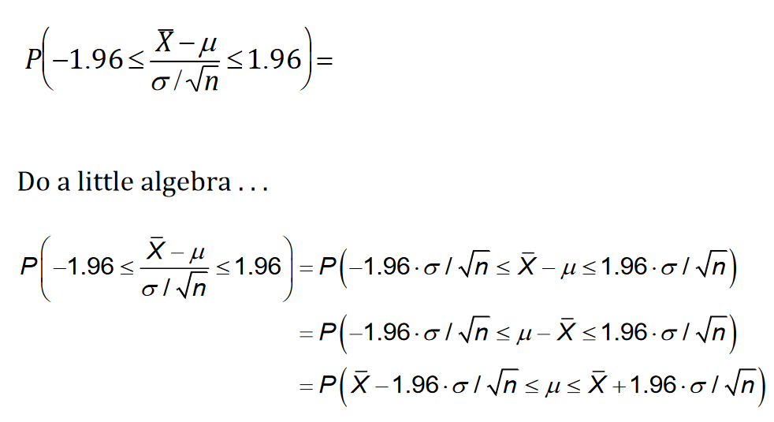

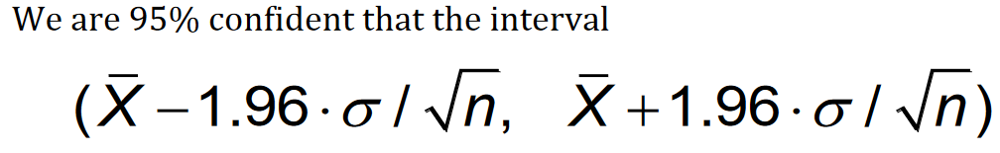

The above interval will contain the value of the population mean. 95% of the intervals constructed using this method from random samples of the population will contain the mean.  A specific interval either will contain the population parameter or it will not. The probability of making an error is 5%. If we want a 90% confidence interval or a 99% confidence interval then we should change 1.96 to the appropriate number.

Let Zα/2 be the percentile such that P(Z ≤ Zα/2 ) = 1 - α/2 (which is the same as P(Z >  Zα/2 ) = α/2.  i.e., Zα/2 is the (1 α/2) × 100% percentile of the standard normal distribution.

Now we can formulate for the Confidence Interval of the Mean when σ is known with the following assumptions:

- Our sample is a random sample from some population.
- The population from which the sample came is normally distributed or the sample size n ≥ 30
- The standard deviation σ is known.

Then the formula can be given by:

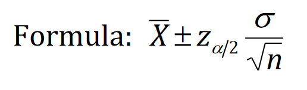

Often, we need to decide how big of a sample we need to make a precise estimate of the population parameter.  This answer relies on 3 things namely:

- the maximum error of estimate
- the population standard deviation, and
- the degree of confidence.

So, formula for the Minimum Sample Size needed for an Interval Estimate of the Population Mean is given by:

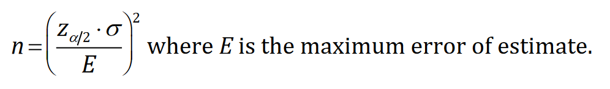

If the answer is not a whole number be sure to round up to the next whole number (never round down).
There are some important concept about confidence level and is given below:

- It is NOT the probability that our interval contains the population parameter.  A specific interval either does contain the parameter or it does not.  
- It IS the proportion of all intervals constructed using this mechanism that will contain the population parameter.

Till now we have discussed the estimation of mean when the population is normally distributed and σ is known with atleast 30 samples. Now, when σ is unknown, we can no longer use the standard normal distribution, but instead we will use a t-distribution.

The t distribution is similar to the standard normal distribution in these ways:

- It is bell-shaped
- It is symmetric about the mean
- The mean, median, and mode are equal to 0 and are located at the center of the distribution
- The curve never touches the x-axis

The t distribution differs from the standard normal distribution in the following ways:

- The variance is greater than 1 (i.e., the t distribution has more variability than a standard normal distribution).
- The t distribution is actually a family of curves based on the concept of degrees of freedom, which is
related to sample size.
- The shape of the t curve changes depending on the degrees of freedom.
- As the sample size increases, the t distribution becomes more and more liked the standard normal distribution.

*Degrees of freedom (df)* - the number of values that are free to vary after a sample statistic has been computed.

The degrees of freedom for a confidence interval for the mean when σ is unknown is found by

Sample size - 1 OR n - 1

So, tht formula for a Specific Confidence Interval for the Mean when σ is unknown is given by

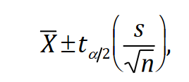

where s is sample standard deviation and tα/2 is the 1 - α/2 quantile of a t distribution with n - 1 degrees of freedom.

##### Test of proportions

*Definitions*

- The population proportion will be denoted by the letter p.
- The point estimate of the population proportion is the sample proportion.
- We will symbolize the sample proportion by p̂ , called p hat.
- For large random samples, the central limit theorem tells us that the sampling distribution of the sample proportion is approximately normal.
- The distribution will have mean p and a standard deviation of

Now we formulate for a Confidence Interval for a Proportion with the following assumptions:  

- The data are a random sample from the population.
- Both np̂ and nˆq are each greater than or equal to 5.

So the formula is:

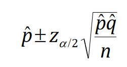

*Rounding Rule for a confidence interval for a proportion:* round to 3 decimal places.

Now we can determine the sample size necessary to achieve the desired precision of a confidence interval as:

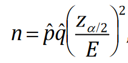

where E is the desired level of precision. If necessary, round up to obtain a whole number.

If an estimate of the proportion isn’t given, use p̂ = 0.5  since this is the worst case scenario (we will have to sample the most subjects to obtain the desired precision).

### Hypothesis testing

Hypothesis testing in statistics is a way for us to test the results of a survey or experiment to see if we have meaningful results. Basically we are testing whether our results are valid by figuring out the odds that the results have happened by chance. If the results may have happened by chance, the experiment won’t be repeatable and so has little use. Hypothesis testing can be one of the most confusing aspects because before we can even perform a test, we have to know what our null hypothesis is. We discuss this in details in the following subsections.

##### Classical hypothesis testing

Classical statistical hypothesis testing involves the test of a null hypothesis against an alternative hypothesis. The procedure consists of five steps, the first four of which are completed before the data to be used for the test are gathered, and relate to probabilistic calculations that set up the statistical inference process. It involves the following steps:

*Step 1*

The first step in a hypothesis testing procedure is to declare the relevant null hypothesis H0 and the relevant alternative hypothesis H1. The choice of null and alternative hypotheses should be made before the data are seen. To decide on a hypothesis as a result of the data is to introduce a bias into the procedure, invalidating any conclusion that might be drawn from it. Our aim is eventually to accept or to reject the null hypothesis as the result of an objective statistical procedure, using data in our decision.

It is important to clarify the meaning of the expression “the null hypothesis is accepted.” In the conservative approach to statistical hypothesis testing as outlined below, this expression means that there is no statistically significant evidence for rejecting the null hypothesis in favor of the alternative hypothesis. For reasons discussed below, the null hypothesis is often a particular case of the alternative hypothesis, and when it is, the alternative hypothesis must explain the data at least as well as the null hypothesis. Despite this, the null hypothesis might well be accepted, in the above sense, in that the alternative hypothesis might not explain the data significantly better than does the null hypothesis. A better expression for “accepting” is thus "not rejecting".

It is important to note the words “in favor of the alternative hypothesis” in the above. Suppose that the null hypothesis is that the probability of success p in a binomial distribution is 1/2 and the alternative is that this parameter exceeds 1/2. Suppose further that in 1,000 trials, only 348 successes are observed. The null hypothesis is accepted in favor of the alternative since the alternative hypothesis does not explain this result significantly better than does the null hypothesis - in fact it explains it less well than does the null hypothesis. Nevertheless, it would be unreasonable to believe that the null hypothesis is true: the data clearly suggest that p < 1/2 . Thus accepting a null hypothesis in favor of some alternative does not necessarily imply in an absolute sense that the null hypothesis provides a reasonable explanation for the data observed.

A hypothesis can be simple or composite. A simple hypothesis specifies the numerical values of all unknown parameters in the probability distribution of interest. In the above example, both null and alternative hypotheses are simple. A composite alternative does not specify all numerical values of all the unknown parameters. Suppose you have a hypothesis that specifies a distribution with only one parameter p. The hypothesis "p = 0.5" is simple. The hypothesis "p exceeds 0.25" is composite. It is also one−sided (p > 0.25) as opposed to two −sided (p ≠ 0.25).

However, for technical reasons associated with the hypothesis testing theory, it is often advantageous to make the null hypothesis a particular case of the alternative hypothesis. If this is done, then in the example of the previous paragraph, the one-sided alternative p > 0.25 would be replaced by p ≥ 0.25 and the two-sided alternative p ≠ 0.25 would be replaced by “p unspecified.” In practice there is no change to the testing procedures if the null hypothesis is nested within the alternative hypothesis in this way, and we shall freely use both the nested notation such as p ≥ 0.25 and the non-nested notation such as p > 0.25 interchangeably.

Hypotheses usually involve the value of some unknown parameter (or parameters). We generically denote the parameter of interest by θ, although in some cases we use a more specific notation (such as μ for a mean). The nature of the alternative hypothesis is determined by the context of the test, in particular whether it is one-sided up (that is the unknown parameter θ exceeds some specified value θ0), one-sided down (θ < θ0), or two-sided (θ ≠ θ0). In many cases in bioinformatics the natural alternative is both composite and one-sided.

*Step 2 (Type I error and Type II error)*

Step 2 of the hypothesis testing procedure consists in choosing the numerical value for the Type I error. Since the decision to accept or reject H0 will be made on the basis of data derived from some random process, it is possible that an incorrect decision will be made, that is,

- to reject H0 when it is true – a Type I error ), or
- to accept H0 when it is false – a Type II error ).

When testing a null hypothesis against an alternative it is not possible to ensure that the probabilities of making a Type I error and a Type II error are both arbitrarily small unless we are able to make the number of observations as large as we please. In practice we are seldom able to do this.

This dilemma is resolved in practice by observing that there is often an asymmetry in the implications of making the two types of error. For example, there might be more concern about making the false positive claim and less concern about making the false negative conclusion.
For this reason, a frequently adopted procedure is to focus on the Type I error, and to fix the numerical value α of this error at some acceptably low level (usually 1% or 5%), and not to attempt to control the numerical value of the Type II error. The choice of the values 1% and 5% is reasonable, but is also clearly arbitrary. The choice 1% is a more conservative one than the choice 5%.

*Step 3 (Determining the Test Statistic)*

The third step in the hypothesis testing procedure consists in determining a test statistic. This is the quantity calculated from the data whose numerical value leads to acceptance or rejection of the null hypothesis. Although sometime there are reasonable choices for test
statistics that are usually used, in more complicated cases the choice of a test statistic is not straightforward.

The main problem is that of deriving test statistics that, for a given Type I error, minimize the probability of our making a Type II error, given the number of observations to be made. There is a substantial body of statistical theory associated with such an optimal choice of a test statistic.

*Step 4 (Determining the Significance Point K)*

The next step in the procedure consists in determining those observed values of the test statistic that lead to rejection of H0. This choice is made so as to ensure that the test has the numerical value for the Type I error chosen in Step 2. Suppose that the null hypothesis is p = 0.25. Suppose that the alternative hypothesis is simple e.g., “p = 0.35” or the alternative hypothesis is composite "p ≥ 0.25"

Suppose we choose a test statistic as the value observed for a numerical random variable Y whose value the larger and is more away from the Null Hypothesis. Then the Null Hypothesis p = 0.25 is rejected in favor of the alternative when the observed value y of Y is sufficiently large, that is if y is greater than or equal to a significance point K.

If for example the Type I error is chosen as 5%, K is found from the requirement

Prob (null hypothesis is rejected when it is true) = Prob(Y ≥ K | p = 0.25) = 0.05

In practice, when discrete random variables are involved, it may be impossible to arrive at a procedure having exactly the Type I error chosen. This difficulty arises here: It is impossible to find a value of K such that the above equation is satisfied exactly. In practice, the choice of K is made by a conservative procedure. This difficulty is to be taken as understood in all testing procedures when the test statistic is a discrete random variable.

In the above example the null hypothesis is rejected if Y is sufficiently large. If the alternative hypothesis had specified a value of p that is less than 0.25, then the null hypothesis would be rejected for sufficiently small Y. In many test procedures the null hypothesis does not specify the numerical values of all the parameters involved in the distribution of the random variables involved in the test
procedure. In such a case problems can arise in the testing procedure since there might be no unique significance point (such as K above) having the property that the probability that the test statistic exceeds K is equal to the Type I error no matter what the values of the parameters not specified by the null hypothesis.

*Step 5*

The final step in the testing procedure is to obtain the data, and to determine whether the observed value of the test statistic is
equal to or more extreme than the significance point calculated in Step 4, and do the following:

- to reject the null hypothesis if it is.
- Otherwise the null hypothesis is accepted.

##### Hypothesis Testing using P-Value Approach

The P-value approach involves determining "likely" or "unlikely" by determining the probability — assuming the null hypothesis were true — of observing a more extreme test statistic in the direction of the alternative hypothesis than the one observed. If the P-value is small, say less than (or equal to) α, then it is "unlikely." And, if the P-value is large, say more than α, then it is "likely."

If the P-value is less than (or equal to) α, then the null hypothesis is rejected in favor of the alternative hypothesis. And, if the P-value is greater than α, then the null hypothesis is not rejected. Specifically, the four steps involved in using the P-value approach to conducting any hypothesis test are:

- Specify the null and alternative hypotheses.
- Using the sample data and assuming the null hypothesis is true, calculate the value of the test statistic. Again, to conduct the hypothesis test for the population mean μ, we use the t-statistic
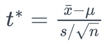
which follows a t-distribution with n - 1 degrees of freedom.
- Using the known distribution of the test statistic, calculate the P-value: "If the null hypothesis is true, what is the probability that we'd observe a more extreme test statistic in the direction of the alternative hypothesis than we did?" (Note how this question is equivalent to the question answered in criminal trials: "If the defendant is innocent, what is the chance that we'd observe such extreme criminal evidence?")
- Set the significance level α, the probability of making a Type I error to be small — 0.01, 0.05, or 0.10. Compare the P-value to α. If the P-value is less than (or equal to) α, reject the null hypothesis in favor of the alternative hypothesis. If the P-value is greater than α, do not reject the null hypothesis.

##### Testing a difference in means

This section explains how to conduct a hypothesis test for the difference between two means. The test procedure, called the two-sample t-test, is appropriate when the following conditions are met:

- The sampling method for each sample is simple random sampling.
- The samples are independent.
- Each population is at least 20 times larger than its respective sample.
- The sampling distribution is approximately normal, which is generally the case if any of the following conditions apply.
 - The population distribution is normal.
 - The population data are symmetric, unimodal, without outliers, and the sample size is 15 or less.
 - The population data are slightly skewed, unimodal, without outliers, and the sample size is 16 to 40.
 - The sample size is greater than 40, without outliers.

In this test we will perform the following steps:

*State the Hypotheses*

Every hypothesis test requires the analyst to state a null hypothesis and an alternative hypothesis. The hypotheses are stated in such a way that they are mutually exclusive. That is, if one is true, the other must be false; and vice versa. The table below shows three sets of null and alternative hypotheses. Each makes a statement about the difference d between the mean of one population μ1 and the mean of another population μ2. (In the table, the symbol ≠ means " not equal to ".)

| Set | Null hypothesis | Alternative hypothesis | Number of tails |
|:----|:---------------:|:----------------------:|:---------------:|
|   1 |   μ1 - μ2 = d   |       μ1 - μ2 ≠ d      |      2          |
|   2 |   μ1 - μ2 > d   |       μ1 - μ2 < d      |      1          |
|   3 |   μ1 - μ2 < d   |       μ1 - μ2 > d      |      1          |

The first set of hypotheses (Set 1) is an example of a two-tailed test, since an extreme value on either side of the sampling distribution would cause a researcher to reject the null hypothesis. The other two sets of hypotheses (Sets 2 and 3) are one-tailed tests, since an extreme value on only one side of the sampling distribution would cause a researcher to reject the null hypothesis. When the null hypothesis states that there is no difference between the two population means (i.e., d = 0), the null and alternative hypothesis are often stated in the following form.

Ho: μ1 = μ2

Ha: μ1 ≠ μ2

*Formulate an Analysis Plan*

The analysis plan describes how to use sample data to accept or reject the null hypothesis. It should specify the following elements.

- Significance level: Often, researchers choose significance levels equal to 0.01, 0.05, or 0.10; but any value between 0 and 1 can be used.
- Test method: Use the two-sample t-test to determine whether the difference between means found in the sample is significantly different from the hypothesized difference between means.

*Analyze Sample Data*

Using sample data, find the standard error, degrees of freedom, test statistic, and the P-value associated with the test statistic. Standard error. Compute the standard error (SE) of the sampling distribution.

        SE = sqrt[ (s12/n1) + (s22/n2) ]

where s1 is the standard deviation of sample 1, s2 is the standard deviation of sample 2, n1 is the size of sample 1, and n2 is the size of sample 2.

Degrees of freedom. The degrees of freedom (DF) is:

        DF = (s12/n1 + s22/n2)2 / { [ (s12 / n1)2 / (n1 - 1) ] + [ (s22 / n2)2 / (n2 - 1) ] }

If DF does not compute to an integer, round it off to the nearest whole number. Some texts suggest that the degrees of freedom can be approximated by the smaller of n1 - 1 and n2 - 1; but the above formula gives better results.

Test statistic: The test statistic is a t statistic (t) defined by the following equation.

        t = [ (x1 - x2) - d ] / SE

where x1 is the mean of sample 1, x2 is the mean of sample 2, d is the hypothesized difference between population means, and SE is the standard error. P-value. The P-value is the probability of observing a sample statistic as extreme as the test statistic. Since the test statistic is a t statistic, use the t Distribution Calculator to assess the probability associated with the t statistic, having the degrees of freedom computed above.

*Interpret Results*

If the sample findings are unlikely, given the null hypothesis, the researcher rejects the null hypothesis. Typically, this involves comparing the P-value to the significance level, and rejecting the null hypothesis when the P-value is less than the significance level.

##### Power Analysis

Consider a research experiment where the p-value computed from the data was 0.12. As a result, one would fail to reject the null hypothesis because this p-value is larger than α = 0.05. However, there still exist two possible cases for which we failed to reject the null hypothesis:

- the null hypothesis is a reasonable conclusion,
- the sample size is not large enough to either accept or reject the null hypothesis, i.e., additional samples might provide additional evidence.

Power analysis is the procedure that researchers can use to determine if the test contains enough power to make a reasonable conclusion. From another perspective power analysis can also be used to calculate the number of samples required to achieve a specified level of power

##### Test of Proportion

Let us consider the parameter p of population proportion. For instance, we might want to know the proportion of males within a total population of adults when we conduct a survey. A test of proportion will assess whether or not a sample from a population represents the true proportion from the entire population. We can perform test of proportion using the following two approaches:

*Critical Value Approach*

The steps to perform a test of proportion using the critical value approval are as follows:

1. State the null hypothesis H0 and the alternative hypothesis HA.
2. Calculate the test statistic:

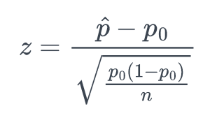

3. Determine the critical region.
4. Make a decision. Determine if the test statistic falls in the critical region. If it does, reject the null hypothesis. If it does not, do not reject the null hypothesis.

*p-value Approach*

Next, let's state the procedure in terms of performing a proportion test using the p-value approach. The basic procedure is:

1. State the null hypothesis H0 and the alternative hypothesis HA.
2. Set the level of significance
3. Calculate the test statistic:
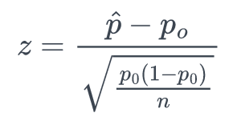
4. Calculate the p-value.
5. Make a decision. Check whether to reject the null hypothesis by comparing p-value to . If the p-value < then reject ; otherwise do not reject .

##### Reference

https://math.ucdenver.edu/~ssantori/MATH2830SP13/
https://databasetown.com/types-probability-distribution-characteristics-examples/
https://online.stat.psu.edu/stat415/lesson/1/1.2
